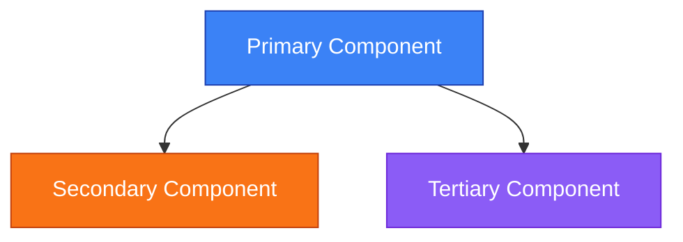
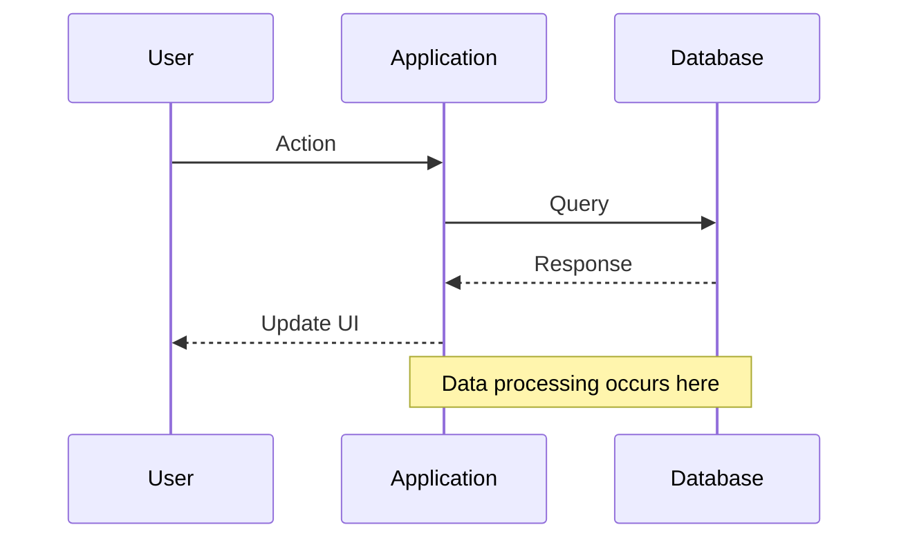
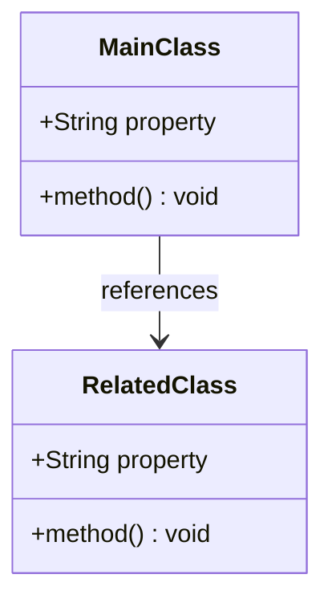
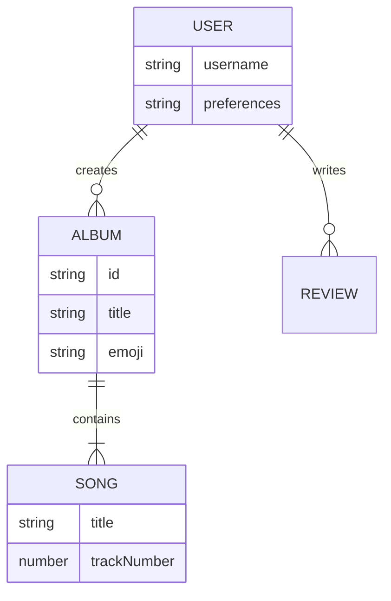

# Mermaid Diagram Style Guide

This guide provides standards for creating consistent diagrams in the Music Besties documentation.

## Diagram Types and Usage

| Diagram Type | Best Used For | Example Usage |
|--------------|---------------|---------------|
| Flowchart | Component relationships, processes | Application architecture, component hierarchy |
| Sequence | Interaction flows, API calls | User interactions, data flow between components |
| Class | Data structures, object models | Data management, state structure |
| ER | Database relationships | Data storage models |
| Gantt | Project timelines | Implementation plans, sprint schedules |
| State | State transitions | User flows, application states |

## Color Standards

Use these standardized colors for consistency across all diagrams:

| Diagram Type | Element Type | Color Code | Usage |
|--------------|--------------|------------|-------|
| All Types | Primary/Main | `#3b82f6` (Blue) | Main components, primary actions |
| All Types | Secondary | `#f97316` (Orange) | Secondary components, user actions |
| All Types | Tertiary | `#8b5cf6` (Purple) | Supporting elements |
| All Types | Success | `#10b981` (Green) | Success states, completed actions |
| All Types | Warning | `#f59e0b` (Amber) | Warning states, caution actions |
| All Types | Error | `#ef4444` (Red) | Error states, destructive actions |
| Flowchart | Background | `#f4f6f8` (Light gray) | Flowchart background |
| Class/ER | Background | `#eef2ff` (Light indigo) | Data structure background |
| Sequence | Background | `#f0fdf4` (Light green) | User flow background |

## Styling Examples

### Flowchart Example



<div class="mermaid-caption">Figure: Component Relationship Example - Shows how components connect in the application. Primary component (blue) connects to both secondary (orange) and tertiary (purple) components.</div>

### Sequence Diagram Example



<div class="mermaid-caption">Figure: User Interaction Flow - Illustrates the sequence of events when a user interacts with the application. Shows data flow between user, application, and storage layers.</div>

### Class Diagram Example



<div class="mermaid-caption">Figure: Data Structure Model - Shows the relationship between main and related classes. The main class references the related class.</div>

### ER Diagram Example



<div class="mermaid-caption">Figure: Data Relationship Model - Shows the relationships between users, albums, songs, and reviews in the application's data structure.</div>

## Best Practices

### For All Diagram Types

1. **Keep diagrams simple** - Focus on the key information you want to convey
2. **Use consistent naming** - Use the same terminology across all diagrams
3. **Add descriptive labels** - Make edge labels descriptive but concise
4. **Include a caption** - Always add a caption using the `mermaid-caption` class
5. **Test responsiveness** - Ensure diagrams render well on different screen sizes
6. **Add hover tooltips** - Use the interactive features for additional context

### Diagram-Specific Guidelines

#### Mermaid Diagrams

- Use the standard color palette defined in this guide
- Add notes to explain complex interactions
- Keep node labels short and descriptive
- Use the caption to explain the diagram's purpose and key elements

#### Markdown Tables

- Use consistent column widths
- Include headers for all columns
- Add a caption below the table using italics
- Consider adding a "Last Updated" row for reference tables

#### ASCII Diagrams

- Use consistent characters for similar elements
- Include a legend explaining the symbols
- Maintain consistent spacing and alignment
- Consider converting complex ASCII diagrams to Mermaid

#### Code Blocks

- Use consistent indentation
- Add comments to explain complex sections
- Include file name and purpose in comments
- Use syntax highlighting appropriate for the language

## Accessibility Considerations

- Ensure sufficient color contrast for all elements (minimum 4.5:1 ratio)
- Don't rely solely on color to convey information
- Add descriptive text captions for all diagrams
- Use patterns or shapes in addition to colors when possible
- Ensure all diagrams have text alternatives

## Technical Implementation

### Mermaid Configuration

The global Mermaid configuration provides:
- Consistent styling across all diagram types
- Dark mode support
- Responsive rendering
- Interactive features (node highlighting on hover/click)
- Diagram-specific color schemes

### CSS Enhancements

Custom CSS has been implemented for:
- Mermaid diagrams (`mermaid-custom.css`)
- Markdown tables (`table-styles.css`)
- ASCII diagrams (`ascii-diagram.css`)
- Code blocks (`code-blocks.css`)

### Standard Templates

When creating new diagrams, use these templates for consistency:

### Mermaid Diagram Template

```
<!-- Mermaid diagram template -->
```mermaid
[diagram code here]
```

<div class="mermaid-caption">Figure: [Diagram Name] - [Brief description]. [Key elements explanation].</div>
```

### ASCII Diagram Template

```
<!-- ASCII diagram template -->
```ascii
[ASCII diagram here]
```

<div class="ascii-diagram-legend">
  <span class="ascii-diagram-legend-item">Symbol → Meaning</span>
</div>
```

### Code Block Template

```
<!-- Code block template -->
<div class="code-block-container">
  <div class="code-block-title">Filename.js</div>
  ```javascript
  // PURPOSE: Brief description
  // LAST UPDATED: YYYY-MM-DD

  // Code here
  ```
  <div class="code-block-footer">Last updated: YYYY-MM-DD</div>
</div>
```
