# Component Details

This section provides detailed specifications for the key components in the Music Besties application.

## Component Hierarchy

The application is structured around these key components, which are implemented in Vue.js:

**Figure: Component Hierarchy**

```mermaid
flowchart TD
    App["App.vue\n(Root component)"] --> Dashboard["DashboardView.vue\n(Main entry point)"];
    App --> EditRankings["EditRankingsView.vue\n(Selection interface)"];
    App --> Sidebar["SidebarPanel.vue\n(Rankings & Reviews)"];
    App --> Navigation["NavigationSystem.vue\n(Global navigation)"];
    
    Dashboard --> EraCard["EraCard.vue\n(Multiple instances in grid)"];
    
    EditRankings --> SelectionTabs["SelectionTabs.vue\n(Tab navigation)"];
    EditRankings --> ItemChips["ItemChip.vue\n(Selectable items)"];
    
    Sidebar --> RankingsList["RankingsList.vue\n(Ordered list)"];
    Sidebar --> ReviewForm["ReviewForm.vue\n(Rating & comments)"];
    
    Navigation --> NavMenu["NavMenu.vue\n(Menu items)"];
    Navigation --> AboutView["AboutView.vue"];
    Navigation --> ProfileView["ProfileView.vue"];
    Navigation --> SettingsView["SettingsView.vue"];
    Navigation --> TermsView["TermsView.vue"];
    
    %% Add styling for component types
    classDef root fill:#f96,stroke:#333,stroke-width:4px;
    classDef primaryViews fill:#9cf,stroke:#333,stroke-width:2px;
    classDef supportingViews fill:#cfc,stroke:#333,stroke-width:1px;
    classDef navSystem fill:#dfd,stroke:#333,stroke-width:1px;
    
    %% Apply classes to nodes
    class App root;
    class Dashboard,EditRankings,Sidebar primaryViews;
    class EraCard,SelectionTabs,ItemChips,RankingsList,ReviewForm supportingViews;
    class Navigation,NavMenu,AboutView,ProfileView,SettingsView,TermsView navSystem;
```



*Tree diagram showing the Vue.js component hierarchy from App.vue down to individual UI elements. This updated diagram reflects the complete application structure including the navigation system and supporting views.*

### Primary Components

- **App.vue**: The root component that manages routing and global state
- **DashboardView.vue**: Main entry point displaying the Era Cards grid
- **EditRankingsView.vue**: Interface for selecting and ranking items
- **SidebarPanel.vue**: Context-sensitive panel for viewing rankings and managing reviews
- **NavigationSystem.vue**: Global navigation system accessible from all views

### Supporting Components

- **EraCard.vue**: Reusable component for era display on the dashboard
- **SelectionTabs.vue**: Tab navigation for different ranking categories
- **ItemChip.vue**: Interactive component for selection functionality
- **RankingsList.vue**: Component for displaying ordered rankings
- **ReviewForm.vue**: Form component for ratings and comments

### Navigation Components

- **NavMenu.vue**: Menu component with navigation links
- **AboutView.vue**: View component for application information
- **ProfileView.vue**: View component for user profile
- **SettingsView.vue**: View component for user settings
- **TermsView.vue**: View component for legal information

### Component: DashboardCard

| Property      | Type             | Required | Description                     |
|---------------|------------------|----------|---------------------------------|
| `tabId`       | `string`         | Yes      | Album identifier                |
| `title`       | `string`         | Yes      | Album title to display          |
| `emoji`       | `string`         | No       | Emoji character for album       |
| `rating`      | `number` (0-5)   | No       | User's rating (whole numbers)   |
| `selectedCount` | `number`         | No       | Number of selected songs        |
| `totalCount`  | `number`         | Yes      | Total number of songs           |

**Events:**

| Event         | Payload           | Description                      |
|---------------|-------------------|----------------------------------|
| `@open-sidebar` | `tabId: string`   | Emitted when card is clicked      |

**CSS Classes:**

* `dashboard-grid-card`
* `dashboard-stars`
```

## Album Sidebar Panel

### Panel Structure and Functionality

The Album Sidebar Panel is a sliding panel that provides detailed information about a selected album. It includes the following features:

- Album title and emoji
- List of songs
- Rating and review information
- Navigation to other albums

### Album Example

The sidebar panel displays album information in a structured format, with clear sections for songs, ratings, and reviews.

**Figure: Album Sidebar Panel Layout**

```ascii
+-----------------------------------------------------+
|  ← Red ❤️                                          |
+-----------------------------------------------------+
|                                                     |
| Songs:                                              |
|                                                     |
| Ranked:                                             |
| 1. All Too Well                                     |
| 2. State of Grace                                   |
| 3. 22                                               |
|                                                     |
| Unranked:                                           |
| • Red                                               |
| • I Knew You Were Trouble                           |
| • We Are Never Ever Getting Back Together           |
| • Begin Again                                       |
| • Holy Ground                                       |
| • The Last Time                                     |
| • I Almost Do                                       |
|                                                     |
| Your Review:                                        |
| ★★★★★                                              |
| "This album perfectly captures the emotions of      |
| heartbreak and moving on. All Too Well is an        |
| absolute masterpiece."                              |
|                                                     |
| Last updated: May 5, 2025                           |
|                                                     |
+-----------------------------------------------------+
```

*Detailed panel structure showing the song ranking interface with numbered positions and the scrollable unranked songs section. Demonstrates how the component handles varying amounts of content through scrolling while maintaining a consistent visual structure.*

## Review Panel

The Review Panel allows users to add and edit reviews for albums. It includes:

- Star rating system (0-5 stars)
- Text input for comments
- Save and cancel buttons
- Timestamp information for when the review was last updated

**Figure: Review Panel Layout**

```ascii
+-----------------------------------------------------+
|  Edit Review: Red ❤️                               |
+-----------------------------------------------------+
|                                                     |
| Rating:                                             |
|                                                     |
| ★★★★★                                              |
| ☆☆☆☆☆                                              |
|                                                     |
| Comments:                                           |
|                                                     |
| +---------------------------------------------------+
| | This album perfectly captures the emotions of     |
| | heartbreak and moving on. All Too Well is an      |
| | absolute masterpiece.                             |
| |                                                   |
| |                                                   |
| +---------------------------------------------------+
|                                                     |
| Last updated: May 5, 2025                           |
|                                                     |
| [Save]                [Cancel]                      |
|                                                     |
+-----------------------------------------------------+
```

*Comprehensive view of the star rating system and comment field with timestamp display for album reviews. Shows the expected input mechanisms and data display for the review creation and viewing process.*