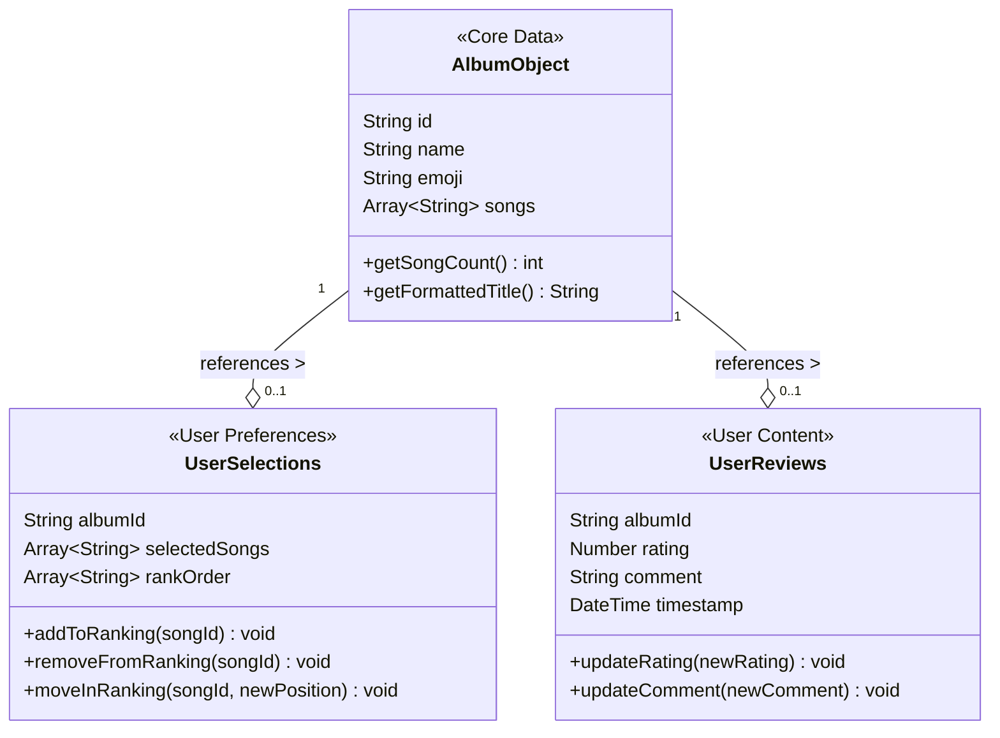
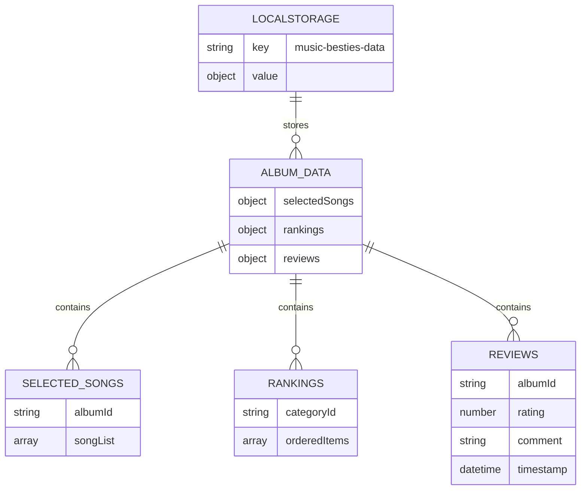

# Data management

This section details the technical implementation of the Music Besties application.

## Overview

<!-- AI: Add relevant and concise text in this section about the application's data structure -->

Music Besties uses a structured data model to organize music era and song information. The application implements a unidirectional data flow pattern with two primary types of data:

1. **Static Era Data**: Pre-defined information about music eras including identifiers, titles, and song lists
2. **User Preference Data**: User-generated content including selections, rankings, ratings, and reviews

The data structure is designed to be lightweight and efficient, with a clear separation between core era data and user-specific preferences. This separation allows the application to reset user data without affecting the underlying era information if needed.

All data is stored locally in the browser's LocalStorage, structured as JSON objects for easy serialization and retrieval. The application uses a reactive state management approach to ensure that UI components automatically update when the underlying data changes.

**Figure: Data Structure Model**

*Conceptual diagram showing the relationships and composition of album objects, user selections, and review data. Provides developers with an understanding of the data architecture to properly implement state management.*

### State Structure

The application's state is stored in LocalStorage with this structure:

**Figure: LocalStorage Data Structure**

*Exact JSON structure showing the format of stored data including selectedSongs, rankings, and reviews with their nested properties. Ensures consistent data persistence implementation with the correct property names and data types.*

This structure is accessed via the key 'music-besties-data' in the browser's LocalStorage. The application loads this data on startup and updates it when changes are made to rankings or reviews.

## Storage Mechanisms

### LocalStorage

The application uses the browser's LocalStorage API to persist user data between sessions. This approach has the following advantages:

- No server-side storage requirements
- Data remains available even when offline
- Simple API for storing and retrieving JSON data

However, it also has limitations:

- Limited storage capacity (typically 5-10MB)
- Data is specific to a browser and device
- No synchronization between devices

### In-memory State

During runtime, the application maintains an in-memory state that is synchronized with LocalStorage. This approach provides:

- Fast access to data during user interactions
- Ability to make temporary changes before persisting
- Simplified state management through Vue.js reactivity

