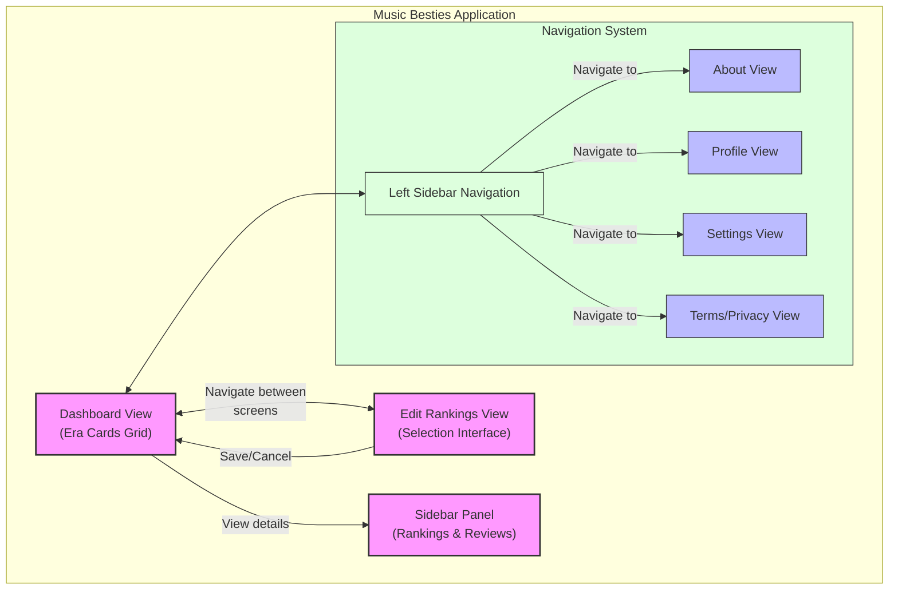

# Overview - Music Besties App

Music Besties is a web application designed to help music enthusiasts organize, rank, and review their favorite albums and songs. The application provides an intuitive interface for creating personalized music collections with custom rankings and detailed reviews.

## Page by page overview <!-- AI: Never edit this text -->

| View | UI Elements and Their Purpose | User Actions |  
|------|--------------------------------|--------------|
| **Dashboard View** | • **Header Bar**: Contains app title "My Rankings", hamburger menu icon, and Edit button • **Era Cards Grid**: 2-column (mobile) or 3-column (desktop) grid displaying music era information • **Selection Counter**: Shows number of selected items vs. total (e.g., "2 of 10") • **Rating Display**: Star icons (1-5) showing user ratings when available • **Era Emoji**: Visual icon representing each music era • **Footer Disclaimer**: Text indicating unofficial status of the app | • **Open navigation menu**: Tap hamburger icon • **Enter edit mode**: Tap Edit button • **View era details**: Tap on any era card • **View rankings**: Scan cards to see current selections • **Check ratings**: View star ratings on cards • **Return to top**: Scroll to beginning of grid |
| **Edit Rankings View** | • **Header Controls**: Cancel button (red), screen title, Save button (green) • **Tab Navigation Bar**: Horizontally scrollable tabs for "Eras" and individual era names • **Selection Counter**: Shows selected/total count for each tab • **Instruction Text**: Contextual heading explaining selection process • **Item Chips**: Interactive buttons for each selectable item (era or song) • **Selection Indicators**: Blue highlighting and rank numbers (1, 2, 3...) on selected items | • **Switch tabs**: Tap tab buttons to change category • **Select items**: Tap unselected chips to add to ranking • **Remove selections**: Tap selected chips to remove from ranking • **Change order**: Remove and re-add items to change ranking order • **Save changes**: Tap Save button to persist selections • **Cancel editing**: Tap Cancel to discard changes and return to dashboard |
| **Sidebar Panel** | • **Panel Header**: Title showing selected era/category name and X close button • **Tab Navigation**: Two tabs - "Rankings" and "Review & Notes" • **Rankings List**: Ordered list of user's ranked items for the selected category • **Star Rating Display**: 1-5 star rating visualization • **Review Text Area**: User's written review/comment when available • **Review Form**: Star selection inputs, text area with 140 char limit, character counter, save/cancel buttons | • **Switch sidebar tabs**: Tap tab buttons to toggle between rankings and review • **View rankings**: See ordered list of selected items • **Add/edit review**: Tap Edit Review button • **Set rating**: Select star rating (1-5) • **Write comment**: Enter text in comment field (max 140 chars) • **Save review**: Submit rating and comment • **Close sidebar**: Tap X button to return to previous view |
| **About View** | • **Header Bar**: "About" title and back button • **App Description**: Text explaining app purpose and functionality • **Version Information**: App version number and release notes • **Credits Section**: Developer and contributor information • **Text Sections**: Formatted content with headings and paragraphs | • **Read information**: Scroll through content sections • **Check version**: View current app version • **See credits**: View developer information • **Return to previous screen**: Tap back button |
| **Profile View** | • **Header Bar**: "Profile" title and back button • **Profile Image**: User avatar/photo placeholder or image • **User Information**: Display name and account details • **Statistics Section**: Counters for rankings created, reviews written, account age • **Preferences Area**: User-specific settings and options | • **View profile data**: See account information and statistics • **Check activity**: Review ranking and review history • **Access settings**: Navigate to account-related settings • **Return to previous screen**: Tap back button |
| **Settings View** | • **Header Bar**: "Settings" title and back button • **Settings Categories**: Grouped options with section headers • **Toggle Switches**: On/off controls for boolean settings • **Radio Buttons**: Selection controls for mutually exclusive options • **Dropdown Menus**: Selection controls for multiple choice options • **Setting Descriptions**: Help text explaining each setting's purpose | • **Toggle options**: Turn features on/off • **Select preferences**: Choose from available options • **Adjust display settings**: Modify visual preferences • **Manage notifications**: Control notification behavior • **Configure data options**: Set data storage preferences • **Return to previous screen**: Tap back button |
| **Terms/Privacy View** | • **Header Bar**: "Terms & Privacy" title and back button • **Section Headers**: Titled segments for different legal topics • **Legal Text**: Terms of service and privacy policy content • **Data Usage Section**: Information about how user data is handled • **Last Updated Timestamp**: Date when legal documents were last modified | • **Read legal information**: Scroll through terms and privacy policy • **Review data practices**: Learn about data handling policies • **Check update date**: See when documents were last updated • **Return to previous screen**: Tap back button |
| **Left Sidebar Navigation** | • **App Branding**: App name/logo at top of sidebar • **Navigation Menu**: Vertical list of app sections (Dashboard, Profile, Settings, etc.) • **Menu Icons**: Visual icons next to each menu item • **Active Indicator**: Highlighting or styling showing current section • **Close Button**: X button in top corner to dismiss sidebar | • **Navigate to section**: Tap menu item to go to that screen • **See current location**: Identify active section by highlight • **Close menu**: Tap X button or swipe to dismiss • **Access all app areas**: Reach any major section from one menu |

## Text Overview <!-- AI: Never edit this text -->

Music Besties lets you explore, rank, and review your favorite music eras and songs with simple, clear actions.

- **Browse and Explore:** On the main screen, you can scroll through cards showing different music eras. Tap any card to see detailed rankings and reviews for that era.
- **Edit Your Rankings:** Tap the Edit button to enter ranking mode. Switch between tabs to see different eras or categories. Tap items to add them to your favorites, tap again to remove them, and reorder your picks by removing and re-adding. When you’re happy, save your changes or cancel to keep things as they were.
- **View and Write Reviews:** In the sidebar that opens when you select an era, switch between your ranked list and the review tab. You can rate the era with stars, write a short comment, edit your review anytime, and save your feedback.
- **Navigate Easily:** Use the hamburger menu to open the sidebar navigation. From there, jump to any major section like Dashboard, Profile, Settings, About, or Terms \& Privacy.
- **Manage Your Profile:** View your profile details, see how many rankings and reviews you’ve created, and access your preferences.
- **Adjust Settings:** Change app themes, notification preferences, and other options to customize your experience.
- **Learn About the App:** Read about the app’s purpose, version info, and credits in the About section.
- **Review Legal Info:** Check the Terms \& Privacy section to understand how your data is handled and the app’s policies.
- **Close and Return:** Easily close sidebars or menus and return to previous screens whenever you want.

## High-Level Architecture

Music Besties follows a component-based architecture that promotes modularity, reusability, and maintainability. The application is structured around core views with supporting components that work together to create a cohesive user experience.

### Core Application Structure

1. **Primary Views**
   - **Dashboard View**: The main entry point displaying Era Cards in a responsive grid layout with selection counters and rating displays
   - **Edit Rankings View**: Interactive interface for selecting and ranking items across different categories
   - **Sidebar Panel**: Context-sensitive panel for viewing rankings and managing reviews
   - **Navigation Sidebar**: Global navigation system accessible from all views

2. **Supporting Views**
   - **About View**: Informational content about the application
   - **Profile View**: User-specific information and statistics
   - **Settings View**: User preference configuration
   - **Terms/Privacy View**: Legal documentation

3. **UI Component Hierarchy**
   - **Global Components**: Header bars, navigation elements, and footer disclaimers
   - **Content Components**: Era cards, item chips, selection indicators, and rating displays
   - **Interactive Elements**: Buttons, tabs, toggles, and form inputs

### Data Flow Architecture

The application implements a unidirectional data flow pattern:
- User selections and rankings are stored and retrieved from a persistent data layer
- UI state changes (like entering edit mode) are managed through state containers
- Reviews and ratings follow a create-read-update pattern with validation

**Figure: Application Architecture**

*Visual representation of the application's structural organization showing the relationships between primary views, supporting views, and the navigation system. The diagram illustrates how users move between different screens and access functionality through the unified interface.*

### Technical Implementation Considerations

- **Responsive Design**: The UI adapts between mobile (2-column) and desktop (3-column) layouts
- **State Management**: Tracks selections, rankings, and review content across view transitions
- **Navigation Patterns**: Implements hierarchical navigation with breadcrumb-style return paths
- **Data Persistence**: Maintains user rankings and reviews between sessions
- **Accessibility**: Incorporates clear visual indicators and semantic structure

