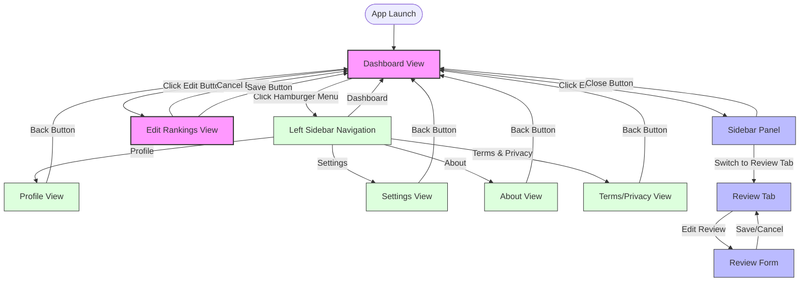

# User Navigation

## User Journey Map

The Music Besties application offers several navigation paths based on user goals. Below are the primary user journeys through the application.

### Primary Navigation Flows

## User Personas and Navigation Patterns

### Casual Listener

**Primary Goals:**
- Browse album collection
- View existing rankings
- Occasionally update ratings

**Typical Navigation Path:**
1. Dashboard → Browse albums
2. Click album → View sidebar with details
3. Close sidebar → Return to browsing

### Dedicated Curator

**Primary Goals:**
- Maintain detailed rankings of all songs
- Write comprehensive reviews
- Organize collection meticulously

**Typical Navigation Path:**
1. Dashboard → Select specific album
2. Edit Rankings → Spend time organizing songs
3. Return to Dashboard → Select another album
4. Open Sidebar → Write detailed review

### New User

**Primary Goals:**
- Understand app functionality
- Set up initial rankings
- Explore features

**Typical Navigation Path:**
1. Dashboard → Explore interface
2. Click album → Discover sidebar functionality
3. Edit Rankings → Learn ranking mechanism
4. Return to Dashboard → Continue exploration

## Navigation Decision Points

| Screen | Decision Point | Possible Actions | Next Screens |
|--------|----------------|------------------|-------------|
| Dashboard | Album selection | Click album card | Album Sidebar |
| Dashboard | Edit mode | Click Edit Rankings | Edit Rankings Screen |
| Album Sidebar | Review management | Click Edit Review | Review Panel |
| Album Sidebar | Return to browsing | Click Close | Dashboard |
| Edit Rankings | Song organization | Drag songs, Change tabs | Remains on Edit Rankings |
| Edit Rankings | Exit with changes | Click Back with unsaved changes | Confirmation Modal |
| Confirmation Modal | Data preservation | Confirm or Cancel | Dashboard or Edit Rankings |