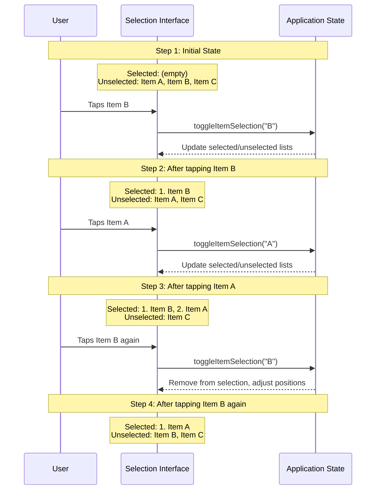

# User Interactions

This section shows all possible ways users can interact with the app <!-- AI: Never edit this text -->

## Selection and Ranking Workflow

**Figure: Selection Interaction Flow**

*Step-by-step visualization of how items transition between selected and unselected states through user tap interactions. Clarifies the exact behavior expected when users interact with selectable items, including the visual state changes and numbering.*

### Era Ranking

The era ranking workflow allows users to create a personalized ranking of their favorite music eras. The process works as follows:

1. User navigates to the Edit Rankings View
2. User selects the "Eras" tab
3. User taps on unselected era chips to add them to the ranking
4. The order is determined by the sequence of selection
5. User taps on selected era chips to remove them from the ranking
6. User saves changes to persist the ranking

### Song Ranking

The song ranking workflow allows users to create a personalized ranking of songs within an era. The process works as follows:

1. User navigates to the Edit Rankings View
2. User selects an era-specific tab
3. User taps on unselected song chips to add them to the ranking
4. The order is determined by the sequence of selection
5. User taps on selected song chips to remove them from the ranking
6. User saves changes to persist the ranking

## Review Workflow

### Creating/Editing Reviews

The review creation workflow allows users to add ratings and comments to music eras. The process works as follows:

1. User navigates to the Dashboard View
2. User taps on an era card to open the Sidebar Panel
3. User switches to the "Review & Notes" tab
4. User taps the Edit Review button
5. User sets a star rating (1-5 stars)
6. User adds a text comment (maximum 140 characters)
7. User saves the review to persist the changes

### Viewing Reviews

Users can view reviews for eras through the Sidebar Panel. The process works as follows:

1. User navigates to the Dashboard View
2. User taps on an era card to open the Sidebar Panel
3. User switches to the "Review & Notes" tab
4. The review section displays the current rating and comment

## Navigation Patterns

### Dashboard Navigation

The Dashboard View provides the following navigation options:

- Tapping the hamburger menu icon opens the Left Sidebar Navigation
- Tapping the Edit button enters edit mode
- Tapping on an era card opens the Sidebar Panel for that era

### Edit Rankings Navigation

The Edit Rankings View provides the following navigation options:

- Tabs allow switching between "Eras" and individual era names
- The Cancel button (red) discards changes and returns to the Dashboard View
- The Save button (green) persists changes and returns to the Dashboard View

### Sidebar Panel Navigation

The Sidebar Panel provides the following navigation options:

- The X close button closes the panel and returns to the previous view
- Tabs allow switching between "Rankings" and "Review & Notes"
- The Edit Review button navigates to the review form

### Left Sidebar Navigation

The Left Sidebar Navigation provides the following navigation options:

- Menu items for Dashboard, Profile, Settings, About, and Terms & Privacy
- The X close button dismisses the sidebar
- Visual indicators show the currently active section