# Component Details

This section provides detailed specifications for the key components in the Music Besties application v1.1.

## Component Hierarchy

The application is structured around these key components, which are implemented in Vue.js:

**Figure: Component Hierarchy**

```mermaid
flowchart TD
    App["App.vue\n(Root component)"] --> Dashboard["DashboardView.vue\n(Main entry point)"];
    App --> EditRankings["EditRankingsView.vue\n(Selection interface)"];
    App --> Sidebar["SidebarPanel.vue\n(Your Journal | Community | Besties)"];
    App --> Navigation["NavigationSystem.vue\n(Global navigation)"];
    App --> BestieMatching["BestieMatchingView.vue\n(Social matching)"];
    App --> Onboarding["OnboardingView.vue\n(New user flow)"];
    
    Dashboard --> EraCard["EraCard.vue\n(Multiple instances in grid)"];
    Dashboard --> HistoryIndicator["HistoryIndicator.vue\n(Ranking history indicator)"];
    
    EditRankings --> SelectionTabs["SelectionTabs.vue\n(Tab navigation)"];
    EditRankings --> ItemChips["ItemChip.vue\n(Selectable items)"];
    EditRankings --> CooldownTimer["CooldownTimer.vue\n(24-hour save limit)"];
    
    Sidebar --> MainTabNavigation["MainTabNavigation.vue\n(Tab navigation)"];
    Sidebar --> RankingsList["RankingsList.vue\n(Ordered list)"];
    Sidebar --> SongCard["SongCard.vue\n(Song display)"];
    Sidebar --> ReviewDisplay["ReviewDisplay.vue\n(Rating & review)"];
    Sidebar --> CommentSection["CommentSection.vue\n(User comments)"];
    Sidebar --> CommunityReviewsList["CommunityReviewsList.vue\n(Other users' reviews)"];
    Sidebar --> BestieMatchList["BestieMatchList.vue\n(Similar users)"];
    Sidebar --> ShareOptions["ShareOptions.vue\n(Social sharing)"];
    
    BestieMatching --> LeagueTable["LeagueTable.vue\n(User similarity ranking)"];
    BestieMatching --> RedditVerification["RedditVerification.vue\n(Account verification)"];
    
    Onboarding --> WelcomeCarousel["WelcomeCarousel.vue\n(Introduction slides)"];
    Onboarding --> GuestModeButton["GuestModeButton.vue\n(Quick start option)"];
    Onboarding --> ComparisonFlow["ComparisonFlow.vue\n(Shared link entry)"];
    
    Navigation --> NavMenu["NavMenu.vue\n(Menu items)"];
    Navigation --> AboutView["AboutView.vue"];
    Navigation --> ProfileView["ProfileView.vue"];
    Navigation --> SettingsView["SettingsView.vue"];
    Navigation --> TermsView["TermsView.vue"];
    
    %% Add styling for component types
    classDef root fill:#f96,stroke:#333,stroke-width:4px;
    classDef primaryViews fill:#9cf,stroke:#333,stroke-width:2px;
    classDef supportingViews fill:#cfc,stroke:#333,stroke-width:1px;
    classDef navSystem fill:#dfd,stroke:#333,stroke-width:1px;
    classDef newFeatures fill:#fcf,stroke:#333,stroke-width:2px;
    
    %% Apply classes to nodes
    class App root;
    class Dashboard,EditRankings,Sidebar primaryViews;
    class EraCard,SelectionTabs,ItemChips,RankingsList,ReviewForm supportingViews;
    class Navigation,NavMenu,AboutView,ProfileView,SettingsView,TermsView navSystem;
    class BestieMatching,Onboarding,HistoryIndicator,CooldownTimer,HistoryTab,ShareOptions,LeagueTable,RedditVerification,WelcomeCarousel,GuestModeButton,ComparisonFlow newFeatures;
```



*Tree diagram showing the Vue.js component hierarchy from App.vue down to individual UI elements. This updated diagram reflects the complete application structure including the new v1.1 features like Bestie Matching, Onboarding, History tracking, and the 24-hour cooldown timer.*

### Primary Components

- **App.vue**: The root component that manages routing and global state
- **DashboardView.vue**: Main entry point displaying the Era Cards grid
- **EditRankingsView.vue**: Interface for selecting and ranking items
- **SidebarPanel.vue**: Context-sensitive panel with three-layer navigation for personal journal content, community interactions, and bestie matching
- **NavigationSystem.vue**: Global navigation system accessible from all views
- **BestieMatchingView.vue**: New in v1.1 - Interface for finding users with similar music taste
- **OnboardingView.vue**: New in v1.1 - Introduction flow for new users

### Supporting Components

- **EraCard.vue**: Reusable component for era display on the dashboard
- **SelectionTabs.vue**: Tab navigation for different ranking categories
- **ItemChip.vue**: Interactive component for selection functionality
- **MainTabNavigation.vue**: New in v1.1 - Tab navigation between Your Journal, Community, and Besties
- **RankingsList.vue**: Component for displaying ordered rankings
- **SongCard.vue**: New in v1.1 - Compact display of song with rank, rating, and comment count
- **ReviewDisplay.vue**: New in v1.1 - Display and edit interface for personal reviews
- **CommentSection.vue**: New in v1.1 - Sequential blog-like commenting system
- **CommunityReviewsList.vue**: New in v1.1 - List of reviews from other users
- **BestieMatchList.vue**: New in v1.1 - Display of connected and discoverable users with similar tastes
- **HistoryIndicator.vue**: New in v1.1 - Visual indicator for available ranking history
- **CooldownTimer.vue**: New in v1.1 - Timer displaying cooldown period for ranking saves
- **ShareOptions.vue**: New in v1.1 - Interface for sharing rankings and reviews
- **LeagueTable.vue**: New in v1.1 - Table showing users with similar music taste
- **RedditVerification.vue**: New in v1.1 - Interface for verifying Reddit account
- **WelcomeCarousel.vue**: New in v1.1 - Carousel of introduction slides for new users
- **GuestModeButton.vue**: New in v1.1 - Button for starting in guest mode
- **ComparisonFlow.vue**: New in v1.1 - Flow for users arriving via shared links

### Navigation Components

- **NavMenu.vue**: Menu component with navigation links
- **AboutView.vue**: View component for application information
- **ProfileView.vue**: View component for user profile
- **SettingsView.vue**: View component for user settings
- **TermsView.vue**: View component for legal information

## New Components in v1.1

### Component: MainTabNavigation

| Property      | Type             | Required | Description                     |
|---------------|------------------|----------|---------------------------------|
| `tabs`        | `Array<Object>`  | Yes      | List of available tabs          |
| `activeTabId` | `string`         | Yes      | ID of the currently active tab  |
| `currentLayer`| `number`         | Yes      | Current navigation layer (1-3)  |
| `disableBestiesInLayer3` | `boolean` | No    | Whether to disable Besties tab in Layer 3 |

**Tab Object Structure:**

```javascript
{
  id: String,           // Unique identifier
  title: String,        // Display name
  icon: String,         // Optional icon name
  disabled: Boolean     // Whether tab is disabled
}
```

**Events:**

| Event         | Payload           | Description                      |
|---------------|-------------------|----------------------------------|
| `@tab-change` | `tabId: string`   | Emitted when a tab is selected   |

**CSS Classes:**

* `main-tab-navigation`
* `main-tab-navigation__tab`
* `main-tab-navigation__tab--active`
* `main-tab-navigation__tab--disabled`

**Implementation Notes:**

- Implements the primary tab navigation for the sidebar panel
- Automatically disables the Besties tab when in Layer 3
- Provides visual indication of the currently active tab
- Supports keyboard navigation between tabs
- Handles touch and mouse interactions

### Component: SongCard

| Property      | Type             | Required | Description                     |
|---------------|------------------|----------|---------------------------------|
| `song`        | `Object`         | Yes      | Song data object                |
| `rank`        | `number`         | Yes      | User's ranking of the song      |
| `compact`     | `boolean`        | No       | Whether to use compact display  |

**Song Object Structure:**

```javascript
{
  id: String,             // Unique identifier
  title: String,          // Song title
  artist: String,         // Artist name (optional)
  albumTitle: String,     // Album title
  duration: Number,       // Duration in seconds
  userRating: Number,     // User's rating (1-5)
  commentCount: Number,   // Number of user comments
  imageUrl: String        // Album art URL
}
```

**Events:**

| Event         | Payload           | Description                      |
|---------------|-------------------|----------------------------------|
| `@select`     | `songId: string`  | Emitted when card is selected    |

**CSS Classes:**

* `song-card`
* `song-card--compact`
* `song-card__rank`
* `song-card__title`
* `song-card__rating`
* `song-card__comment-count`

**Implementation Notes:**

- Displays a song with its rank, rating, and comment count
- Compact mode shows minimal information for list views
- Expanded mode includes more details and interaction options
- Uses star icons for rating display
- Shows comment count with speech bubble icon

### Component: ReviewDisplay

| Property      | Type             | Required | Description                     |
|---------------|------------------|----------|---------------------------------|
| `review`      | `Object`         | Yes      | Review data object              |
| `editable`    | `boolean`        | No       | Whether review can be edited    |
| `showHistory` | `boolean`        | No       | Whether to show review history  |

**Review Object Structure:**

```javascript
{
  id: String,             // Unique identifier
  rating: Number,         // Rating (1-5)
  content: String,        // Review text
  lastUpdated: Date,      // Last update timestamp
  history: Array          // Previous versions
}
```

**Events:**

| Event         | Payload           | Description                      |
|---------------|-------------------|----------------------------------|
| `@edit`       | `{}`              | Emitted when edit button clicked |
| `@save`       | `review: Object`  | Emitted when review is saved     |
| `@view-history` | `date: Date`    | Emitted when history item clicked|

**CSS Classes:**

* `review-display`
* `review-display--editing`
* `review-display__rating`
* `review-display__content`
* `review-display__history`

**Implementation Notes:**

- Displays a user's review with rating and text content
- Supports editing mode with star rating input and text area
- Shows timestamp of last update
- Provides horizontal scrolling history of previous versions
- Clicking on history item loads that version for viewing

### Component: CommentSection

| Property      | Type             | Required | Description                     |
|---------------|------------------|----------|---------------------------------|
| `comments`    | `Array<Object>`  | Yes      | List of comment objects         |
| `itemId`      | `string`         | Yes      | ID of the item being commented on |
| `allowAdding` | `boolean`        | No       | Whether to show add comment UI  |
| `maxLength`   | `number`         | No       | Maximum comment length          |

**Comment Object Structure:**

```javascript
{
  id: String,             // Unique identifier
  content: String,        // Comment text
  timestamp: Date,        // Creation timestamp
  userId: String,         // User who created the comment
  username: String        // Display name of user
}
```

**Events:**

| Event         | Payload           | Description                      |
|---------------|-------------------|----------------------------------|
| `@add-comment`| `content: string` | Emitted when new comment added   |
| `@delete-comment` | `commentId: string` | Emitted when comment deleted |

**CSS Classes:**

* `comment-section`
* `comment-section__list`
* `comment-section__item`
* `comment-section__input`
* `comment-section__timestamp`

**Implementation Notes:**

- Displays comments in reverse chronological order (newest first)
- Supports adding new comments with character counter
- Shows timestamps in relative format (e.g., "2 days ago")
- Allows deleting own comments
- Implements infinite scrolling for long comment lists

### Component: CommunityReviewsList

| Property      | Type             | Required | Description                     |
|---------------|------------------|----------|---------------------------------|
| `reviews`     | `Array<Object>`  | Yes      | List of community review objects|
| `itemId`      | `string`         | Yes      | ID of the item being reviewed   |
| `sortBy`      | `string`         | No       | Sort method (recent, rating)    |
| `maxPreviewLength` | `number`     | No       | Max length for preview text     |

**Community Review Object Structure:**

```javascript
{
  id: String,             // Unique identifier
  userId: String,         // User who created the review
  username: String,       // Display name of user
  rating: Number,         // Rating (1-5)
  content: String,        // Review text
  timestamp: Date,        // Creation timestamp
  commentCount: Number,   // Number of comments on this review
  userProfileUrl: String  // URL to user's profile
}
```

**Events:**

| Event         | Payload           | Description                      |
|---------------|-------------------|----------------------------------|
| `@expand-review` | `reviewId: string` | Emitted when review is expanded |
| `@view-profile` | `userId: string` | Emitted when profile link clicked |

**CSS Classes:**

* `community-reviews-list`
* `community-reviews-list__item`
* `community-reviews-list__rating`
* `community-reviews-list__username`
* `community-reviews-list__preview`
* `community-reviews-list__actions`

**Implementation Notes:**

- Displays a list of reviews from other users
- Shows username, rating, and preview of review content
- Provides expand option to view full review and comments
- Includes link to view user's profile
- Supports sorting by recency or rating
- Implements infinite scrolling for long lists

### Component: BestieMatchList

| Property      | Type             | Required | Description                     |
|---------------|------------------|----------|---------------------------------|
| `matches`     | `Array<Object>`  | Yes      | List of user match objects      |
| `itemId`      | `string`         | Yes      | ID of the era or "all" for global|
| `showConnected` | `boolean`      | No       | Whether to show connected users |
| `showDiscover` | `boolean`       | No       | Whether to show discoverable users |

**Match Object Structure:**

```javascript
{
  userId: String,           // Unique identifier
  username: String,         // Display name
  matchPercentage: Number,  // 0-100 similarity score
  connectionDate: Date,     // When connection was made (if connected)
  connectionType: String,   // "outgoing" or "incoming"
  topRankings: Array,       // List of top ranked songs/eras
  profileUrl: String        // Link to user profile
}
```

**Events:**

| Event         | Payload           | Description                      |
|---------------|-------------------|----------------------------------|
| `@connect`    | `userId: string`  | Emitted when connect button clicked |
| `@view-profile` | `userId: string` | Emitted when profile link clicked |

**CSS Classes:**

* `bestie-match-list`
* `bestie-match-list__section`
* `bestie-match-list__item`
* `bestie-match-list__username`
* `bestie-match-list__percentage`
* `bestie-match-list__connection-icon`
* `bestie-match-list__rankings`

**Implementation Notes:**

- Displays users with similar music taste in two sections: Connected and Discover
- Shows match percentage prominently
- Displays connection status with directional icons (↑ for outgoing, ↓ for incoming)
- Shows top ranked songs/eras as scrollable chips
- Provides connect button for users in the Discover section
- Includes link to view user's profile

### Component: HistoryIndicator

| Property      | Type             | Required | Description                     |
|---------------|------------------|----------|---------------------------------|
| `historyCount`| `number`         | Yes      | Number of historical entries    |
| `lastUpdated` | `Date`           | Yes      | Date of most recent update      |
| `showDetails` | `boolean`        | No       | Whether to show detailed info   |

**Events:**

| Event         | Payload           | Description                      |
|---------------|-------------------|----------------------------------|
| `@view-history` | `{}` | Emitted when indicator is clicked |

**CSS Classes:**

* `history-indicator`
* `history-indicator--active`
* `history-indicator--pulse`

**Implementation Notes:**

- Displays a subtle icon when history is available
- Pulses briefly when new history is recorded
- Shows tooltip with last update date on hover
- Clicking opens the History tab in the sidebar

### Component: CooldownTimer

| Property      | Type             | Required | Description                     |
|---------------|------------------|----------|---------------------------------|
| `lastSaveTime`| `Date`           | Yes      | Timestamp of last ranking save  |
| `cooldownHours`| `number`        | No       | Hours between saves (default: 24)|
| `showProgress`| `boolean`        | No       | Whether to show progress bar    |

**Events:**

| Event         | Payload           | Description                      |
|---------------|-------------------|----------------------------------|
| `@cooldown-complete` | `{}` | Emitted when cooldown period ends |

**CSS Classes:**

* `cooldown-timer`
* `cooldown-timer--active`
* `cooldown-timer--complete`
* `cooldown-timer__progress`

**Implementation Notes:**

- Displays remaining time until next save is available
- Shows progress bar if `showProgress` is true
- Updates in real-time (minutes/seconds when close to completion)
- Emits event when cooldown period ends
- Persists between sessions using localStorage

### Component: LeagueTable

| Property      | Type             | Required | Description                     |
|---------------|------------------|----------|---------------------------------|
| `matches`     | `Array<Object>`  | Yes      | Array of user match objects     |
| `currentUser` | `Object`         | Yes      | Current user's information      |
| `maxEntries`  | `number`         | No       | Maximum entries to display      |
| `showDetails` | `boolean`        | No       | Whether to show detailed stats  |

**Match Object Structure:**

```javascript
{
  userId: String,           // Unique identifier
  username: String,         // Display name
  matchPercentage: Number,  // 0-100 similarity score
  commonFavorites: Array,   // Shared favorite songs
  profileUrl: String,       // Link to user profile
  redditUsername: String,   // Verified Reddit username
  isVerified: Boolean       // Verification status
}
```

**Events:**

| Event         | Payload           | Description                      |
|---------------|-------------------|----------------------------------|
| `@view-profile` | `userId: string` | Emitted when user entry is clicked |

**CSS Classes:**

* `league-table`
* `league-table__row`
* `league-table__row--current-user`
* `league-table__match-percentage`
* `league-table__verified-badge`

**Implementation Notes:**

- Displays a ranked list of users with similar music taste
- Highlights the current user's position in the table
- Shows match percentage and common favorites
- Displays verification badge for verified users
- Clicking on a user opens their profile
- Supports pagination for large match lists

### Component: WelcomeCarousel

| Property      | Type             | Required | Description                     |
|---------------|------------------|----------|---------------------------------|
| `slides`      | `Array<Object>`  | Yes      | Array of slide objects          |
| `autoAdvance` | `boolean`        | No       | Whether to auto-advance slides  |
| `interval`    | `number`         | No       | Milliseconds between advances   |
| `currentSlide`| `number`         | No       | Index of current slide          |

**Slide Object Structure:**

```javascript
{
  title: String,       // Slide heading
  content: String,     // Main content text
  image: String,       // Optional image URL
  actionText: String,  // Text for action button
  actionEvent: String  // Event name for action
}
```

**Events:**

| Event         | Payload           | Description                      |
|---------------|-------------------|----------------------------------|
| `@slide-change` | `index: number` | Emitted when slide changes       |
| `@complete`   | `{}` | Emitted when last slide is completed |
| `@action`     | `{actionEvent: string}` | Emitted when slide action is triggered |

**CSS Classes:**

* `welcome-carousel`
* `welcome-carousel__slide`
* `welcome-carousel__navigation`
* `welcome-carousel__action-button`

**Implementation Notes:**

- Displays a series of introduction slides for new users
- Supports navigation dots and next/previous buttons
- Can auto-advance slides with configurable interval
- Supports action buttons on slides for interactive onboarding
- Emits event when carousel is completed
- Responsive design adapts to different screen sizes

### Component: GuestModeButton

| Property      | Type             | Required | Description                     |
|---------------|------------------|----------|---------------------------------|
| `label`       | `string`         | No       | Button text                     |
| `showInfo`    | `boolean`        | No       | Whether to show info tooltip    |
| `disabled`    | `boolean`        | No       | Whether button is disabled      |

**Events:**

| Event         | Payload           | Description                      |
|---------------|-------------------|----------------------------------|
| `@activate-guest` | `{}` | Emitted when button is clicked |

**CSS Classes:**

* `guest-mode-button`
* `guest-mode-button--info`

**Implementation Notes:**

- Provides a quick way to start using the app without creating an account
- Shows information tooltip explaining guest mode limitations
- Triggers guest mode activation when clicked
- Styled to be less prominent than account creation options
- Accessible with keyboard navigation

### Component: ComparisonFlow

| Property      | Type             | Required | Description                     |
|---------------|------------------|----------|---------------------------------|
| `sharedData`  | `Object`         | Yes      | Data from shared link           |
| `showComparison` | `boolean`     | No       | Whether to show comparison view |
| `currentStep` | `number`         | No       | Current step in the flow        |

**Events:**

| Event         | Payload           | Description                      |
|---------------|-------------------|----------------------------------|
| `@complete`   | `{action: string}` | Emitted when flow is completed   |
| `@step-change` | `{step: number}` | Emitted when step changes        |

**CSS Classes:**

* `comparison-flow`
* `comparison-flow__step`
* `comparison-flow__comparison-view`
* `comparison-flow__action-buttons`

**Implementation Notes:**

- Guides users arriving via shared links through a tailored onboarding process
- Shows comparison between shared rankings and user's own (if they exist)
- Provides options to create account, continue as guest, or sign in
- Multi-step flow with progress indicators
- Responsive design adapts to different screen sizes
- Preserves shared data throughout the flow

### Component: HistoryTab

| Property      | Type             | Required | Description                     |
|---------------|------------------|----------|---------------------------------|
| `historyData` | `Array<Object>`  | Yes      | Array of history entries        |
| `selectedEra` | `string`         | No       | Currently selected era          |
| `maxEntries`  | `number`         | No       | Maximum entries to display      |

**History Entry Object Structure:**

```javascript
{
  timestamp: Date,           // When the change occurred
  era: String,               // Affected era
  changes: Array<{           // Array of changes
    song: String,            // Song name
    oldRank: Number|null,    // Previous ranking (null if new)
    newRank: Number|null,    // New ranking (null if removed)
    changeType: String       // "added", "removed", "moved"
  }>
}
```

**Events:**

| Event         | Payload           | Description                      |
|---------------|-------------------|----------------------------------|
| `@select-era` | `era: string` | Emitted when era filter changes |
| `@restore-ranking` | `{timestamp: Date, era: string}` | Emitted when restore is requested |

**CSS Classes:**

* `history-tab`
* `history-tab__entry`
* `history-tab__change`
* `history-tab__change--added`
* `history-tab__change--removed`
* `history-tab__change--moved-up`
* `history-tab__change--moved-down`

**Implementation Notes:**

- Displays a chronological list of ranking changes
- Groups changes by date and era
- Color-codes different types of changes
- Provides filtering by era
- Allows restoring previous rankings
- Shows visual indicators for rank changes (up/down arrows)

### Component: ShareOptions

| Property      | Type             | Required | Description                     |
|---------------|------------------|----------|---------------------------------|
| `contentType` | `string`         | Yes      | Type of content being shared    |
| `contentId`   | `string`         | Yes      | ID of content being shared      |
| `platforms`   | `Array<string>`  | No       | Available sharing platforms     |
| `customMessage` | `string`       | No       | Custom share message            |

**Events:**

| Event         | Payload           | Description                      |
|---------------|-------------------|----------------------------------|
| `@share`      | `{platform: string, url: string}` | Emitted when content is shared |
| `@copy-link`  | `{url: string}` | Emitted when link is copied     |

**CSS Classes:**

* `share-options`
* `share-options__platform-button`
* `share-options__copy-button`
* `share-options__custom-message`

**Implementation Notes:**

- Provides options for sharing rankings and reviews on social platforms
- Supports custom share messages
- Generates shareable links with preview data
- Includes copy-to-clipboard functionality
- Shows success/error feedback for share actions
- Tracks share analytics

## Album Sidebar Panel

### Panel Structure and Functionality

The Album Sidebar Panel is a sliding panel that provides detailed information about a selected album. It includes the following features:

- Album title and emoji
- List of songs
- Rating and review information
- Navigation to other albums
- History of ranking changes (new in v1.1)
- Social sharing options (new in v1.1)

### Album Example

The sidebar panel displays album information in a structured format, with clear sections for songs, ratings, reviews, and history.

**Figure: Album Sidebar Panel Layout**

```ascii
+-----------------------------------------------------+
|  ← Red ❤️                                          |
+-----------------------------------------------------+
| [Rankings] [Reviews] [History]                      |
+-----------------------------------------------------+
|                                                     |
| Songs:                                              |
|                                                     |
| Ranked:                                             |
| 1. All Too Well                                     |
| 2. State of Grace                                   |
| 3. 22                                               |
|                                                     |
| Unranked:                                           |
| • Red                                               |
| • I Knew You Were Trouble                           |
| • We Are Never Ever Getting Back Together           |
| • Begin Again                                       |
| • Holy Ground                                       |
| • The Last Time                                     |
| • I Almost Do                                       |
|                                                     |
| Your Review:                                        |
| ★★★★★                                              |
| "This album perfectly captures the emotions of      |
| heartbreak and moving on. All Too Well is an        |
| absolute masterpiece."                              |
|                                                     |
| Last updated: May 5, 2025                           |
|                                                     |
| [Share Ranking] [Share Review]                      |
|                                                     |
+-----------------------------------------------------+
```

*Detailed panel structure showing the song ranking interface with numbered positions and the scrollable unranked songs section. New in v1.1 are the tabbed interface with History tab and social sharing buttons at the bottom.*

### History Tab Example

```ascii
+-----------------------------------------------------+
|  ← Red ❤️                                          |
+-----------------------------------------------------+
| [Rankings] [Reviews] [History]                      |
+-----------------------------------------------------+
|                                                     |
| Ranking History:                                    |
|                                                     |
| May 8, 2025 (Current)                               |
| 1. All Too Well                                     |
| 2. State of Grace                                   |
| 3. 22                                               |
|                                                     |
| May 1, 2025                                         |
| 1. All Too Well                                     |
| 2. 22                                               |
| 3. State of Grace ↑                                 |
|                                                     |
| April 24, 2025                                      |
| 1. All Too Well                                     |
| 2. 22                                               |
| 3. I Knew You Were Trouble                          |
|                                                     |
| [Restore This Ranking]                              |
|                                                     |
+-----------------------------------------------------+
```

*History tab showing the evolution of rankings over time with indicators for position changes. The user can select a previous ranking to restore it.*

## Review Panel

The Review Panel allows users to add and edit reviews for albums. It includes:

- Star rating system (0-5 stars)
- Text input for comments
- Save and cancel buttons
- Timestamp information for when the review was last updated
- Social sharing options (new in v1.1)

**Figure: Review Panel Layout**

```ascii
+-----------------------------------------------------+
|  Edit Review: Red ❤️                               |
+-----------------------------------------------------+
|                                                     |
| Rating:                                             |
|                                                     |
| ★★★★★                                              |
| ☆☆☆☆☆                                              |
|                                                     |
| Comments:                                           |
|                                                     |
| +---------------------------------------------------+
| | This album perfectly captures the emotions of     |
| | heartbreak and moving on. All Too Well is an      |
| | absolute masterpiece.                             |
| |                                                   |
| |                                                   |
| +---------------------------------------------------+
|                                                     |
| Last updated: May 5, 2025                           |
|                                                     |
| [Save]                [Cancel]        [Share]       |
|                                                     |
| Note: Rankings can only be saved once every 24 hours|
|                                                     |
+-----------------------------------------------------+
```

*Comprehensive view of the star rating system and comment field with timestamp display for album reviews. New in v1.1 are the Share button and the 24-hour cooldown notice.*

## Bestie Matching View

The Bestie Matching View allows users to find others with similar music taste. It includes:

- League table of similar users
- Similarity percentage and common favorites
- Reddit verification status
- Profile viewing options

**Figure: Bestie Matching Layout**

```ascii
+-----------------------------------------------------+
|                 Your Besties                        |
+-----------------------------------------------------+
|                                                     |
| Find fans with similar music taste:                 |
|                                                     |
| +---------------------------------------------------+
| | Rank | User           | Match | Common Favorites  |
| |------|----------------|-------|-------------------|
| | 1    | SwiftFan22 ✓   | 92%   | All Too Well,     |
| |      |                |       | Cruel Summer      |
| |------|----------------|-------|-------------------|
| | 2    | RedLover       | 87%   | State of Grace,   |
| |      |                |       | Delicate          |
| |------|----------------|-------|-------------------|
| | 3    | Folklore1989 ✓ | 81%   | Cardigan,         |
| |      |                |       | Style             |
| |------|----------------|-------|-------------------|
| | 4    | EvermoreFan    | 78%   | Willow,           |
| |      |                |       | The 1             |
| |------|----------------|-------|-------------------|
| | 5    | MidnightsCat ✓ | 75%   | Anti-Hero,        |
| |      |                |       | Lavender Haze     |
| +---------------------------------------------------+
|                                                     |
| Your Rank: 28 of 156 users                          |
|                                                     |
| Note: ✓ indicates verified Reddit users             |
|                                                     |
| [Connect Reddit Account]                            |
|                                                     |
+-----------------------------------------------------+
```

*League table showing users with similar music taste, including match percentage, common favorite songs, and verification status. Users can connect their Reddit account to verify their profile.*

## Onboarding View

The Onboarding View introduces new users to the application. It includes:

- Welcome carousel with feature highlights
- Account creation options
- Guest mode button
- Comparison flow for shared links

**Figure: Onboarding Carousel Layout**

```ascii
+-----------------------------------------------------+
|                 Welcome to Music Besties!            |
+-----------------------------------------------------+
|                                                     |
|                  [Feature Image]                    |
|                                                     |
| Rank Your Favorite Songs                            |
|                                                     |
| Create personalized rankings of your favorite       |
| songs across different albums and eras.             |
|                                                     |
| [•••○○]                                            |
|                                                     |
| [Skip]                               [Next]         |
|                                                     |
+-----------------------------------------------------+
```

*Welcome carousel showing feature highlights with navigation dots and next/skip buttons. This is the first screen new users see when opening the application.*

**Figure: Account Options Layout**

```ascii
+-----------------------------------------------------+
|                 Get Started                          |
+-----------------------------------------------------+
|                                                     |
| Create an account to save your rankings and         |
| connect with other fans:                            |
|                                                     |
| [Sign Up with Email]                                |
|                                                     |
| [Continue with Reddit]                              |
|                                                     |
| Already have an account? [Sign In]                  |
|                                                     |
| [Continue as Guest]                                 |
|                                                     |
| By continuing, you agree to our Terms of Service    |
| and Privacy Policy.                                 |
|                                                     |
+-----------------------------------------------------+
```

*Account options screen showing sign-up methods, sign-in link, and guest mode button. This appears after the welcome carousel or when a user clicks to create an account.*
