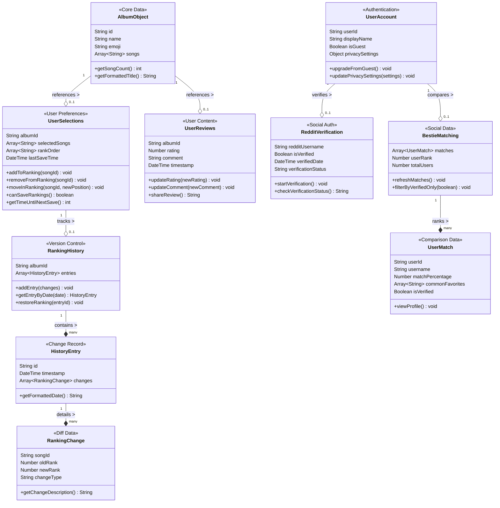
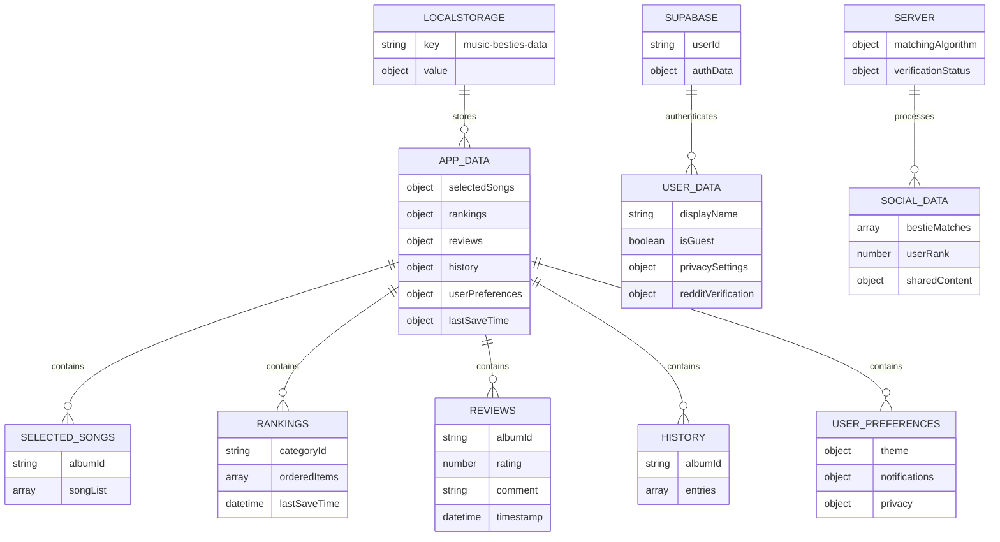

# Data Management

This section details the technical implementation of the Music Besties application v1.1.

## Overview

Music Besties uses a structured data model to organize music era and song information. The application implements a unidirectional data flow pattern with several primary types of data:

1. **Static Era Data**: Pre-defined information about music eras including identifiers, titles, and song lists
2. **User Preference Data**: User-generated content including selections, rankings, ratings, and reviews
3. **History Data**: Timestamped records of ranking changes for tracking user preferences over time
4. **User Account Data**: Optional user account information and authentication status
5. **Social Data**: User matching data and Reddit verification status

The data structure is designed to be lightweight and efficient, with a clear separation between core era data and user-specific preferences. This separation allows the application to reset user data without affecting the underlying era information if needed.

Data is stored in multiple locations depending on its type and purpose:
- Core application data is stored locally in the browser's LocalStorage
- User account data is managed through Supabase authentication
- Social comparison data is processed on the server but controlled by user privacy settings

The application uses a reactive state management approach to ensure that UI components automatically update when the underlying data changes.

**Figure: Enhanced Data Structure Model**



*Conceptual diagram showing the relationships and composition of album objects, user selections, review data, ranking history, user accounts, and social features. Provides developers with an understanding of the enhanced data architecture to properly implement state management for v1.1 features.*

### State Structure

The application's state is stored in multiple locations with this structure:

**Figure: Enhanced Storage Data Structure**



*Enhanced JSON structure showing the format of stored data including selectedSongs, rankings, reviews, history, and user preferences with their nested properties. Ensures consistent data persistence implementation with the correct property names and data types for v1.1 features.*

## Storage Mechanisms

### LocalStorage

The application uses the browser's LocalStorage API to persist user data between sessions. This approach has the following advantages:

- No server-side storage requirements for core functionality
- Data remains available even when offline
- Simple API for storing and retrieving JSON data

However, it also has limitations:

- Limited storage capacity (typically 5-10MB)
- Data is specific to a browser and device
- No synchronization between devices without additional services

### In-memory State

During runtime, the application maintains an in-memory state that is synchronized with LocalStorage. This approach provides:

- Fast access to data during user interactions
- Ability to make temporary changes before persisting
- Simplified state management through Vue.js reactivity

### Supabase Integration

For v1.1, the application integrates with Supabase for user authentication and social features:

- User accounts and authentication
- Reddit verification status
- Privacy settings storage
- Cross-device synchronization (for authenticated users)

### Server-side Processing

Social comparison features require server-side processing:

- Bestie matching algorithm compares user preferences
- League table generation ranks users by similarity
- Shared content generation creates shareable links and previews

## Data Models

### History Tracking

Ranking history is stored as a series of timestamped entries with change details:

```javascript
{
  "history": {
    "red": [
      {
        "id": "hist_1683590400000",
        "timestamp": "2025-05-08T15:00:00.000Z",
        "changes": [
          {
            "songId": "state_of_grace",
            "oldRank": 3,
            "newRank": 2,
            "changeType": "moved"
          },
          {
            "songId": "22",
            "oldRank": 2,
            "newRank": 3,
            "changeType": "moved"
          }
        ]
      },
      {
        "id": "hist_1682985600000",
        "timestamp": "2025-05-01T15:00:00.000Z",
        "changes": [
          {
            "songId": "i_knew_you_were_trouble",
            "oldRank": 3,
            "newRank": null,
            "changeType": "removed"
          },
          {
            "songId": "state_of_grace",
            "oldRank": null,
            "newRank": 3,
            "changeType": "added"
          }
        ]
      }
    ]
  }
}
```

### Cooldown Timer

The application enforces a 24-hour cooldown between ranking saves by tracking the last save time:

```javascript
{
  "lastSaveTime": {
    "red": "2025-05-08T15:00:00.000Z",
    "fearless": "2025-05-07T10:30:00.000Z"
  }
}
```

The cooldown timer component uses this data to:
1. Calculate time remaining until next save is allowed
2. Display appropriate feedback to users
3. Enable/disable the save button based on eligibility

### Privacy Settings

User privacy settings control what information is visible to other users:

```javascript
{
  "privacySettings": {
    "publicProfile": true,
    "showRankings": true,
    "showReviews": true,
    "showBesties": false
  }
}
```

These settings are applied when:
1. Generating public profile pages
2. Calculating bestie matches
3. Creating shareable content

### Reddit Verification

Reddit verification status is stored to determine access to social features:

```javascript
{
  "redditVerification": {
    "username": "music_fan_123",
    "isVerified": true,
    "verifiedDate": "2025-05-05T09:15:00.000Z",
    "verificationStatus": "verified"
  }
}
```

Possible verification statuses include:
- "not_verified" - User has not initiated verification
- "pending" - Verification in progress
- "verified" - Successfully verified
- "failed" - Verification unsuccessful

## Data Flow

### Ranking Updates with History

When a user saves new rankings, the application:

1. Compares the new rankings with the previous state
2. Generates a change record with added, removed, and moved items
3. Creates a timestamped history entry with the changes
4. Updates the current rankings in LocalStorage
5. Updates the lastSaveTime to enforce the 24-hour cooldown
6. Triggers a UI update to reflect the changes

### Social Data Processing

The bestie matching feature follows this data flow:

1. User preferences are anonymized and sent to the server
2. Server compares preferences with other users' data
3. Similarity scores are calculated based on ranking overlap
4. A league table is generated with match percentages
5. Results are filtered based on privacy settings
6. The UI is updated to display matches

### Guest Mode to Account Upgrade

When a guest user creates an account:

1. LocalStorage data is preserved
2. User authentication is established with Supabase
3. LocalStorage data is associated with the new user ID
4. Default privacy settings are applied
5. User is prompted to verify their Reddit account
6. UI is updated to reflect authenticated status

## Data Security and Privacy

### Local-First Approach

The application follows a local-first approach where:
- Core functionality works without server connectivity
- Personal data remains on the device when possible
- Server interactions are limited to social features

### Privacy by Design

Privacy controls are implemented following these principles:
- Opt-in sharing (all sharing is disabled by default)
- Granular controls for different types of data
- Clear visual indicators for what's being shared
- Easy way to revoke access to shared content

### Data Minimization

For social features, the application:
- Only shares the minimum data needed for functionality
- Anonymizes data where possible
- Respects user privacy settings at all times
- Provides transparency about what data is used for matching
