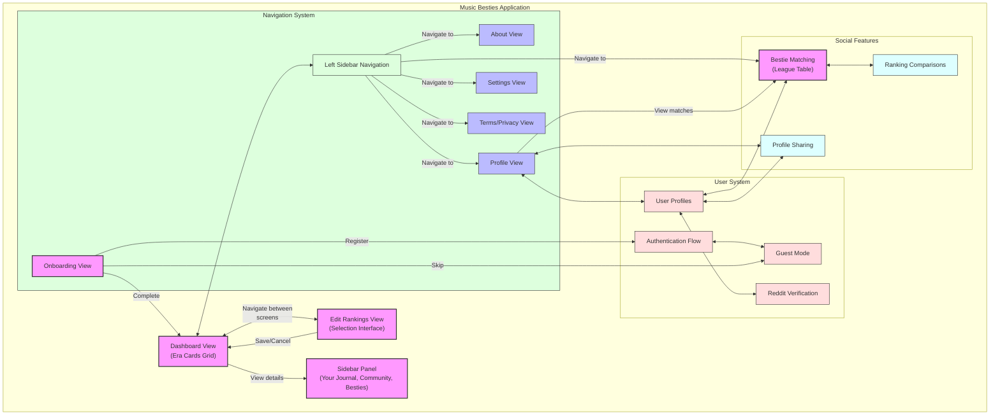

# Overview - Music Besties App

Music Besties is a web application designed to help music enthusiasts organize, rank, and review their favorite albums and songs. The application provides an intuitive interface for creating personalized music collections with custom rankings and detailed reviews, while also connecting users with other fans who share similar musical tastes.

## Page by page overview <!-- AI: Never edit this text -->

| View | UI Elements and Their Purpose | User Actions |  
|------|--------------------------------|--------------|
| **Dashboard View** | • **Header Bar**: Contains app title "My Rankings", hamburger menu icon, and Edit button • **Era Cards Grid**: 2-column (mobile) or 3-column (desktop) grid displaying music era information • **Selection Counter**: Shows number of selected items vs. total (e.g., "2 of 10") • **Rating Display**: Star icons (1-5) showing user ratings when available • **Era Emoji**: Visual icon representing each music era • **History Icon**: Indicator showing ranking history is available • **Footer Disclaimer**: Text indicating unofficial status of the app | • **Open navigation menu**: Tap hamburger icon • **Enter edit mode**: Tap Edit button • **View era details**: Tap on any era card • **View rankings**: Scan cards to see current selections • **Check ratings**: View star ratings on cards • **View ranking history**: Tap history icon to see how rankings changed over time • **Return to top**: Scroll to beginning of grid |
| **Edit Rankings View** | • **Header Controls**: Cancel button (red), screen title, Save button (green) • **Cooldown Timer**: Display showing time until next ranking save is available • **Tab Navigation Bar**: Horizontally scrollable tabs for "Eras" and individual era names • **Selection Counter**: Shows selected/total count for each tab • **Instruction Text**: Contextual heading explaining selection process • **Item Chips**: Interactive buttons for each selectable item (era or song) • **Selection Indicators**: Blue highlighting and rank numbers (1, 2, 3...) on selected items | • **Switch tabs**: Tap tab buttons to change category • **Select items**: Tap unselected chips to add to ranking • **Remove selections**: Tap selected chips to remove from ranking • **Change order**: Remove and re-add items to change ranking order • **Save changes**: Tap Save button to persist selections (once per 24 hours) • **Check cooldown**: View time remaining until next save • **Cancel editing**: Tap Cancel to discard changes and return to dashboard |
| **Sidebar Panel** | • **Sticky Header**: Breadcrumb navigation path that freezes during scrolling • **Main Tab Navigation**: Three primary tabs - "Your Journal", "Community", and "Besties" • **Three-Layer Navigation**: Layer 1 (main tabs), Layer 2 (content lists), Layer 3 (detail views) • **Song Cards**: Compact display of songs with rank, rating, and comment count • **Review Display**: User's rating, review text, and review history • **Comment Section**: Sequential blog-like commenting system for songs • **Community Reviews List**: Reviews from other users with preview text • **Bestie Match List**: Connected and discoverable users with similar tastes • **Share Button**: Option to share content on social media | • **Navigate layers**: Move between different levels of content • **Switch tabs**: Toggle between Your Journal, Community, and Besties • **View song list**: See ranked songs for an era with ratings and comment counts • **View song details**: Tap song to see full review and comments • **Add/edit reviews**: Create or modify ratings and review text • **Add comments**: Add sequential comments to songs • **View community content**: See reviews and comments from other users • **Connect with besties**: Find and connect with users who have similar taste • **Share content**: Share reviews and rankings on social media • **Use breadcrumb navigation**: Return to previous views • **Close sidebar**: Tap X button to return to dashboard |
| **About View** | • **Header Bar**: "About" title and back button • **App Description**: Text explaining app purpose and functionality • **Version Information**: App version number and release notes • **Credits Section**: Developer and contributor information • **Text Sections**: Formatted content with headings and paragraphs | • **Read information**: Scroll through content sections • **Check version**: View current app version • **See credits**: View developer information • **Return to previous screen**: Tap back button |
| **Profile View** | • **Header Bar**: "Profile" title and back button • **Profile Image**: User avatar/photo placeholder or image • **User Information**: Display name and account details • **Public Link**: Unique shareable URL to user's public profile • **Statistics Section**: Counters for rankings created, reviews written, account age • **Preferences Area**: User-specific settings and options • **Share Button**: Option to share profile on social media • **Bestie Matches**: Section showing users with similar music taste | • **View profile data**: See account information and statistics • **Check activity**: Review ranking and review history • **Access settings**: Navigate to account-related settings • **Copy public link**: Get shareable link to public profile • **Share profile**: Share profile on social platforms • **View besties**: See users with similar music preferences • **Return to previous screen**: Tap back button |
| **Settings View** | • **Header Bar**: "Settings" title and back button • **Settings Categories**: Grouped options with section headers • **Toggle Switches**: On/off controls for boolean settings • **Radio Buttons**: Selection controls for mutually exclusive options • **Dropdown Menus**: Selection controls for multiple choice options • **Setting Descriptions**: Help text explaining each setting's purpose • **Privacy Controls**: Options to control what's visible on public profile • **Account Verification**: Reddit account verification section | • **Toggle options**: Turn features on/off • **Select preferences**: Choose from available options • **Adjust display settings**: Modify visual preferences • **Manage notifications**: Control notification behavior • **Configure data options**: Set data storage preferences • **Set privacy**: Control what others can see • **Verify account**: Connect Reddit account • **Return to previous screen**: Tap back button |
| **Terms/Privacy View** | • **Header Bar**: "Terms & Privacy" title and back button • **Section Headers**: Titled segments for different legal topics • **Legal Text**: Terms of service and privacy policy content • **Data Usage Section**: Information about how user data is handled • **Last Updated Timestamp**: Date when legal documents were last modified | • **Read legal information**: Scroll through terms and privacy policy • **Review data practices**: Learn about data handling policies • **Check update date**: See when documents were last updated • **Return to previous screen**: Tap back button |
| **Left Sidebar Navigation** | • **App Branding**: App name/logo at top of sidebar • **Navigation Menu**: Vertical list of app sections (Dashboard, Profile, Settings, etc.) • **Menu Icons**: Visual icons next to each menu item • **Active Indicator**: Highlighting or styling showing current section • **Close Button**: X button in top corner to dismiss sidebar • **Login/Register**: Account access options for guest users | • **Navigate to section**: Tap menu item to go to that screen • **See current location**: Identify active section by highlight • **Close menu**: Tap X button or swipe to dismiss • **Access all app areas**: Reach any major section from one menu • **Create account**: Register as a new user • **Login**: Access existing account |
| **Bestie Matching View** | • **Header Bar**: "Your Besties" title and back button • **League Table**: Ranked list of users by similarity score • **Similarity Percentage**: Numerical display of match percentage • **User Profiles**: Clickable entries for each matched user • **Comparison Details**: Expandable sections showing matching preferences • **Filter Options**: Controls to sort or filter matches | • **View matches**: See ranked list of similar users • **Check similarity**: View match percentage with other users • **Explore profiles**: Tap on users to view their public profiles • **See details**: Expand entries to view specific matching preferences • **Filter results**: Sort or filter the league table • **Return to previous screen**: Tap back button |
| **Onboarding View** | • **Welcome Screens**: Introduction to app features • **Guest Mode Option**: Button to start using app without account • **Registration Form**: Fields for creating new account • **Comparison Flow**: Special flow for users arriving via shared links • **Progress Indicators**: Dots or bars showing onboarding progress • **Skip Button**: Option to bypass detailed onboarding | • **Learn app features**: Swipe through introduction screens • **Start as guest**: Begin using app without registration • **Create account**: Enter details to register • **Compare rankings**: For users from shared links, create rankings to compare • **Track progress**: See position in onboarding flow • **Skip ahead**: Bypass remaining onboarding steps |

## Text Overview <!-- AI: Never edit this text -->

Music Besties lets you explore, rank, and review your favorite music eras and songs with simple, clear actions, while connecting with other fans who share your musical taste.

- **Browse and Explore:** On the main screen, you can scroll through cards showing different music eras. Tap any card to see detailed rankings and reviews for that era.
- **Edit Your Rankings:** Tap the Edit button to enter ranking mode. Switch between tabs to see different eras or categories. Tap items to add them to your favorites, tap again to remove them, and reorder your picks by removing and re-adding. When you're happy, save your changes (once every 24 hours) or cancel to keep things as they were.
- **Track Your History:** View your review history with horizontal scrolling of previous versions, letting you see how your opinions and ratings have evolved over time.
- **View and Write Reviews:** In the sidebar that opens when you select an era, switch between Your Journal, Community, and Besties tabs. In Your Journal, you can view your ranked songs, tap on a song to see details, rate it with stars, write reviews, add comments, and see your review history. In the Community tab, you can see reviews and comments from other users.
- **Share Your Rankings:** Share your profile, rankings, and reviews on social media with eye-catching graphics to connect with other fans.
- **Find Your Besties:** Switch to the Besties tab in the sidebar to see users whose music taste matches yours, divided into Connected users and potential matches in the Discover section. View match percentages, see their top ranked songs displayed as scrollable chips, and connect with new besties who share your musical preferences.
- **Start Without an Account:** Begin using the app immediately as a guest, and create an account later when you're ready to save your progress or compare with others.
- **Verify Your Account:** Connect your Reddit account to verify you're part of positive fan communities, enabling access to social features.
- **Navigate Easily:** Use the hamburger menu to open the sidebar navigation. From there, jump to any major section like Dashboard, Profile, Settings, About, or Terms & Privacy.
- **Manage Your Profile:** View your profile details, see how many rankings and reviews you've created, control what's visible to others, and access your preferences.
- **Adjust Settings:** Change app themes, notification preferences, privacy controls, and other options to customize your experience.
- **Learn About the App:** Read about the app's purpose, version info, and credits in the About section.
- **Review Legal Info:** Check the Terms & Privacy section to understand how your data is handled and the app's policies.
- **Close and Return:** Easily close sidebars or menus and return to previous screens whenever you want.

## High-Level Architecture

Music Besties follows a component-based architecture that promotes modularity, reusability, and maintainability. The application is structured around core views with supporting components that work together to create a cohesive user experience.

### Core Application Structure

1. **Primary Views**
   - **Dashboard View**: The main entry point displaying Era Cards in a responsive grid layout with selection counters, rating displays, and history indicators
   - **Edit Rankings View**: Interactive interface for selecting and ranking items across different categories, with cooldown timer for ranking sessions
   - **Sidebar Panel**: Context-sensitive panel with three-layer navigation for personal journal content, community interactions, and bestie matching
   - **Navigation Sidebar**: Global navigation system accessible from all views, with account options
   - **Bestie Matching View**: League table showing users with similar music preferences
   - **Onboarding View**: Introduction flow for new users with guest mode option

2. **Supporting Views**
   - **About View**: Informational content about the application
   - **Profile View**: User-specific information, statistics, and sharing options
   - **Settings View**: User preference and privacy configuration
   - **Terms/Privacy View**: Legal documentation

3. **UI Component Hierarchy**
   - **Global Components**: Header bars, navigation elements, and footer disclaimers
   - **Content Components**: Era cards, item chips, selection indicators, rating displays, and history visualizations
   - **Interactive Elements**: Buttons, tabs, toggles, form inputs, and sharing controls
   - **Social Components**: Profile links, sharing widgets, and bestie comparison displays

### Data Flow Architecture

The application implements a unidirectional data flow pattern:
- User selections and rankings are stored and retrieved from a persistent data layer
- UI state changes (like entering edit mode) are managed through state containers
- Reviews and ratings follow a create-read-update pattern with validation
- Ranking history is tracked with timestamps and version control
- User authentication state determines available features and data access
- Social comparisons are calculated through similarity algorithms

**Figure: Application Architecture**

*Visual representation of the application's structural organization showing the relationships between primary views, supporting views, the navigation system, user management, and social features. The diagram illustrates how users move between different screens and access functionality through the unified interface.*

### Technical Implementation Considerations

- **Responsive Design**: The UI adapts between mobile (2-column) and desktop (3-column) layouts
- **State Management**: Tracks selections, rankings, and review content across view transitions
- **Navigation Patterns**: Implements hierarchical navigation with breadcrumb-style return paths
- **Data Persistence**: Maintains user rankings and reviews between sessions
- **Accessibility**: Incorporates clear visual indicators and semantic structure
- **Authentication**: Supports both guest mode and registered users with Supabase integration
- **Social Integration**: Enables Reddit verification and social media sharing
- **History Tracking**: Maintains versioned history of user rankings with timestamps
- **Session Management**: Enforces 24-hour cooldown between ranking saves
- **Similarity Algorithms**: Calculates match percentages between user preferences
- **Local-First Architecture**: Stores most data locally with cloud synchronization for key features
