# User Navigation

## User Journey Map

The Music Besties application offers several navigation paths based on user goals. Below are the primary user journeys through the application for v1.1.

### Primary Navigation Flows

```mermaid
flowchart TD
    Start([App Launch]) --> FirstTime{First Time?}
    FirstTime -->|Yes| Onboarding[Onboarding View]
    FirstTime -->|No| Dashboard[Dashboard View]
    
    Onboarding -->|Create Account| Dashboard
    Onboarding -->|Continue as Guest| Dashboard
    Onboarding -->|From Shared Link| ComparisonFlow[Comparison Flow]
    ComparisonFlow --> Dashboard
    
    Dashboard -->|Click Era Card| Sidebar[Sidebar Panel]
    Dashboard -->|Click Edit Button| EditRankings[Edit Rankings View]
    Dashboard -->|Click Hamburger Menu| NavSidebar[Left Sidebar Navigation]
    Dashboard -->|Click History Icon| HistorySidebar[Sidebar with History Tab]
    
    NavSidebar -->|Dashboard| Dashboard
    NavSidebar -->|Your Besties| BestieMatching[Bestie Matching View]
    NavSidebar -->|Profile| Profile[Profile View]
    NavSidebar -->|Settings| Settings[Settings View]
    NavSidebar -->|About| About[About View]
    NavSidebar -->|Terms & Privacy| Terms[Terms/Privacy View]
    
    Sidebar -->|Close Button| Dashboard
    Sidebar -->|Switch to Your Journal Tab| SidebarJournal[Your Journal Tab]
    Sidebar -->|Switch to Community Tab| SidebarCommunity[Community Tab]
    Sidebar -->|Switch to Besties Tab| SidebarBesties[Besties Tab]
    
    SidebarJournal -->|Tap Song Card| SongDetail[Song Detail View]
    SidebarJournal -->|Share Button| ShareOptions[Share Dialog]
    SongDetail -->|Edit Review| ReviewPanel[Review Form]
    SongDetail -->|Add Comment| CommentPanel[Comment Form]
    SongDetail -->|View Review History| HistoryView[Review History]
    SongDetail -->|Breadcrumb Navigation| SidebarJournal
    ReviewPanel -->|Save/Cancel| SongDetail
    CommentPanel -->|Save/Cancel| SongDetail
    
    SidebarCommunity -->|Expand Review| CommunityReviewDetail[Community Review Detail]
    SidebarCommunity -->|View Profile| OtherProfile
    CommunityReviewDetail -->|Breadcrumb Navigation| SidebarCommunity
    
    SidebarBesties -->|Connect Button| ConnectionConfirm[Connection Confirmation]
    SidebarBesties -->|View Profile| OtherProfile
    ConnectionConfirm -->|Confirm| SidebarBesties
    
    EditRankings -->|Cancel Button| Dashboard
    EditRankings -->|Save Button| SaveCheck{Cooldown Complete?}
    SaveCheck -->|Yes| SaveSuccess[Save & Return to Dashboard]
    SaveCheck -->|No| CooldownMessage[Show Cooldown Message]
    CooldownMessage --> EditRankings
    
    Profile -->|View All Matches| BestieMatching
    Profile -->|Share Profile| ShareOptions
    Profile -->|Back Button| Dashboard
    
    BestieMatching -->|Verified?| LeagueTable[View League Table]
    BestieMatching -->|Not Verified| VerifyPrompt[Reddit Verification Prompt]
    VerifyPrompt -->|Connect Account| RedditAuth[Reddit OAuth Flow]
    LeagueTable -->|View Profile| OtherProfile[Other User Profile]
    
    Settings -->|Privacy Section| PrivacyControls[Privacy Settings]
    Settings -->|Account Section| AccountOptions[Account Settings]
    Settings -->|Back Button| Dashboard
    
    About -->|Back Button| Dashboard
    Terms -->|Back Button| Dashboard
    
    classDef primaryViews fill:#f9f,stroke:#333,stroke-width:2px;
    classDef supportingViews fill:#bbf,stroke:#333,stroke-width:1px;
    classDef navSystem fill:#dfd,stroke:#333,stroke-width:1px;
    classDef newFeatures fill:#fcf,stroke:#333,stroke-width:2px;
    
    class Dashboard,EditRankings primaryViews;
    class Sidebar,SidebarRankings,SidebarReview,ReviewPanel supportingViews;
    class NavSidebar,Profile,Settings,About,Terms navSystem;
    class Onboarding,ComparisonFlow,HistorySidebar,SidebarHistory,BestieMatching,ShareOptions,SaveCheck,CooldownMessage,RestoreConfirm,LeagueTable,VerifyPrompt,RedditAuth,OtherProfile,PrivacyControls,AccountOptions newFeatures;
```

## User Personas and Navigation Patterns

### Casual Listener

**Primary Goals:**
- Browse album collection
- View existing rankings
- Occasionally update ratings
- Track changes to rankings over time

**Typical Navigation Path:**
1. Dashboard → Browse albums
2. Click album → View sidebar with details
3. Switch to History tab → View ranking changes
4. Close sidebar → Return to browsing

### Dedicated Curator

**Primary Goals:**
- Maintain detailed rankings of all songs
- Write comprehensive reviews
- Organize collection meticulously
- Share rankings and reviews with others

**Typical Navigation Path:**
1. Dashboard → Select specific album
2. Edit Rankings → Spend time organizing songs (mindful of cooldown period)
3. Return to Dashboard → Select another album
4. Open Sidebar → Write detailed review
5. Share rankings or reviews → Connect with others

### Social Explorer

**Primary Goals:**
- Find users with similar music taste
- Compare rankings with others
- Share their own rankings and reviews
- Verify their Reddit account

**Typical Navigation Path:**
1. Dashboard → Open navigation menu
2. Your Besties → View league table
3. Connect Reddit account → Complete verification
4. Explore similar users → View their profiles
5. Return to Dashboard → Share own rankings

### New User

**Primary Goals:**
- Understand app functionality
- Set up initial rankings
- Decide between guest mode and account creation
- Explore features

**Typical Navigation Path:**
1. Onboarding → Learn about features
2. Choose account type → Continue to app
3. Dashboard → Explore interface
4. Click album → Discover sidebar functionality
5. Edit Rankings → Learn ranking mechanism

### Shared Link Visitor

**Primary Goals:**
- View shared content
- Compare with their own preferences
- Potentially create an account

**Typical Navigation Path:**
1. Shared link → Comparison flow
2. View comparison → See similarities/differences
3. Create account or continue as guest → Dashboard
4. Explore more features → Engage with app

## Navigation Decision Points

| Screen | Decision Point | Possible Actions | Next Screens |
|--------|----------------|------------------|-------------|
| Onboarding | Account creation | Create account, Continue as guest | Dashboard |
| Onboarding | Shared link entry | View comparison, Skip | Dashboard, Comparison Flow |
| Dashboard | Album selection | Click album card | Album Sidebar |
| Dashboard | Edit mode | Click Edit Rankings | Edit Rankings Screen |
| Dashboard | History indicator | Click history icon | Sidebar with History tab |
| Sidebar Panel | Layer navigation | Navigate using breadcrumbs | Different navigation layers |
| Sidebar Panel | Tab selection | Switch between Your Journal, Community, Besties | Different sidebar tabs |
| Sidebar Panel | Song selection | Tap on song card | Song detail view |
| Sidebar Panel | Community interaction | Expand community review | Community review detail |
| Sidebar Panel | Bestie connection | Tap Connect button | Connection confirmation |
| Sidebar Panel | Return to browsing | Click Close | Dashboard |
| Edit Rankings | Song organization | Tap songs, Change tabs | Remains on Edit Rankings |
| Edit Rankings | Save attempt | Click Save during cooldown | Cooldown message |
| Edit Rankings | Exit with changes | Click Cancel with unsaved changes | Confirmation Modal |
| Bestie Matching | Verification status | Connect Reddit account | Reddit OAuth flow |
| Bestie Matching | User exploration | Click on user in league table | User profile |
| Settings | Privacy management | Toggle privacy options | Remains on Settings |
| Profile | Social sharing | Click Share Profile | Share options dialog |

## User Experience Considerations

### Onboarding Flow

The onboarding experience is designed to quickly introduce new users to the app's core functionality while providing a frictionless path to start using the app:

- **Progressive disclosure**: Information is presented in digestible chunks through a carousel
- **Multiple entry paths**: Users can create an account, continue as a guest, or enter via a shared link
- **Visual guidance**: Clear illustrations demonstrate key features
- **Minimal friction**: Guest mode allows immediate use without account creation

### Cooldown Timer Experience

The 24-hour cooldown between ranking saves is designed to encourage thoughtful curation:

- **Clear feedback**: Visual timer shows exactly when the next save is available
- **Graceful degradation**: Save button is disabled during cooldown but editing is still possible
- **Persistent state**: Cooldown status persists between sessions
- **Contextual messaging**: Explanatory text helps users understand the purpose of the limitation

### Three-Layer Navigation Experience

The three-layer navigation approach provides users with a clear path through content:

- **Intuitive progression**: Users move from general to specific content through logical layers
- **Breadcrumb navigation**: Clear path showing current location and allowing easy backtracking
- **Sticky header**: Navigation controls remain visible during scrolling
- **Contextual tabs**: Available tabs adapt based on the current layer (Besties tab unavailable in Layer 3)

### Review History Experience

The review history feature provides users with a way to track their evolving opinions:

- **Horizontal scrolling**: Review history is presented as horizontally scrollable date chips
- **Chronological organization**: Previous versions are organized by date
- **One-tap access**: Users can quickly view any previous version of their review
- **Visual consistency**: History view maintains the same visual language across the app

### Social Features Experience

Social features are designed to foster positive community engagement:

- **Privacy-first approach**: All sharing is opt-in with granular controls
- **Verification layer**: Reddit verification ensures community quality
- **Meaningful connections**: Matching is based on genuine taste similarity
- **Progressive engagement**: Basic features work without social features, which are presented as enhancements

## Accessibility Considerations

### Keyboard Navigation

All interactive elements are accessible via keyboard navigation:

- **Logical tab order**: Interactive elements follow a natural flow
- **Focus indicators**: Visible focus states help keyboard users track their position
- **Shortcut keys**: Common actions have keyboard shortcuts

### Screen Reader Support

The application is designed to work well with screen readers:

- **Semantic HTML**: Proper heading structure and landmark regions
- **ARIA attributes**: Enhanced context for interactive elements
- **Alternative text**: All images have descriptive alt text
- **Status announcements**: Changes in application state are announced

### Color and Contrast

Visual design considers users with different visual abilities:

- **High contrast**: Text meets WCAG AA standards for contrast
- **Color independence**: Information is never conveyed by color alone
- **Adjustable text size**: Text scales appropriately with browser settings
- **Focus visibility**: Focus indicators are visible in all color schemes

## Responsive Design

The application adapts to different screen sizes and orientations:

### Mobile Experience

- **Touch-optimized**: Tap targets are appropriately sized for fingers
- **Single-column layout**: Content reflows to fit narrow screens
- **Bottom navigation**: Key actions are within thumb reach
- **Reduced motion**: Animations are minimized for performance

### Tablet Experience

- **Split view**: Sidebar can appear alongside content on larger screens
- **Expanded grid**: Dashboard shows more items per row
- **Touch and pointer**: Supports both touch and mouse interaction

### Desktop Experience

- **Keyboard shortcuts**: Additional shortcuts for power users
- **Hover states**: Enhanced information on hover
- **Expanded views**: More content visible at once
- **Persistent panels**: Multiple panels can be visible simultaneously

## Error Prevention and Recovery

The application is designed to prevent errors and provide clear recovery paths:

### Confirmation Dialogs

Potentially destructive actions require confirmation:

- **Ranking restoration**: Confirming before replacing current rankings
- **Discarding changes**: Confirming when exiting with unsaved changes
- **Account actions**: Confirming significant account changes

### Forgiving Design

The application helps users recover from mistakes:

- **Undo capability**: History feature allows reverting to previous states
- **Clear feedback**: Error messages explain what went wrong
- **Suggested corrections**: Helpful suggestions when errors occur
- **Auto-save**: Draft reviews are preserved when navigating away
