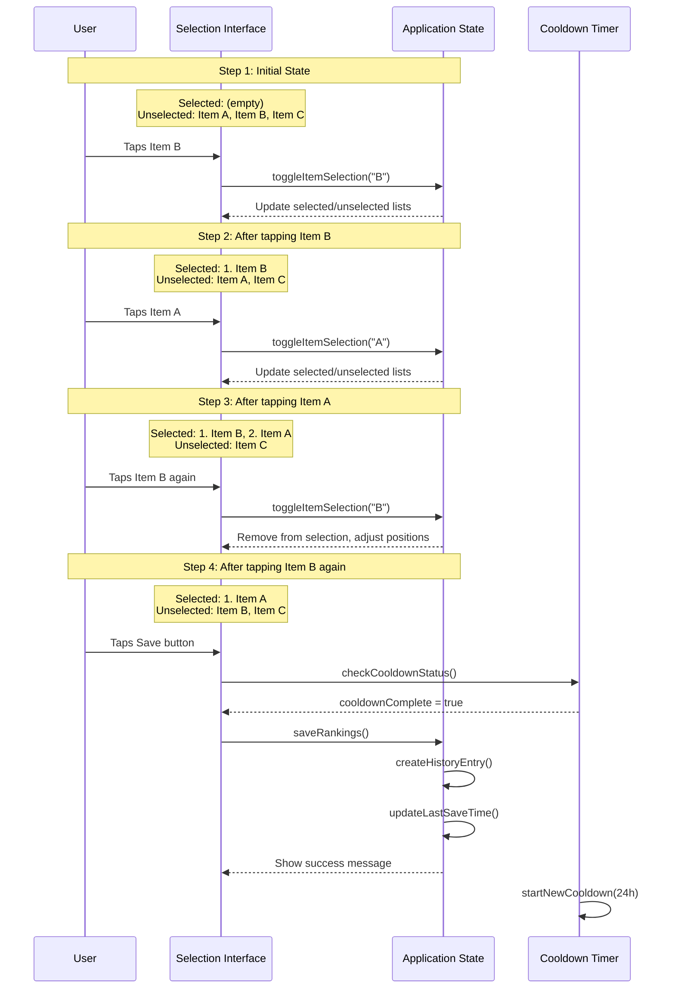
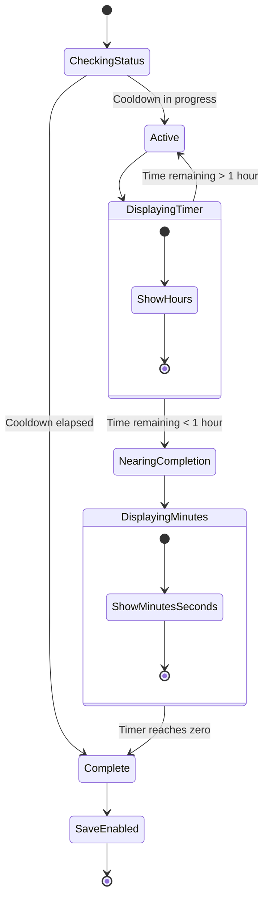
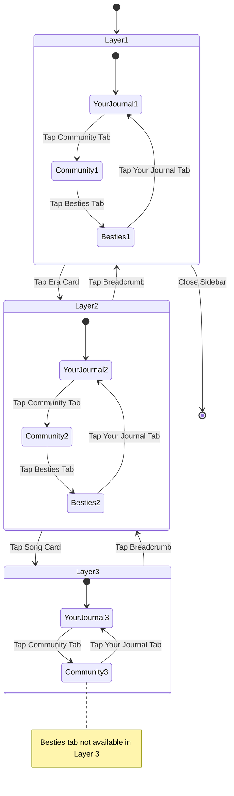
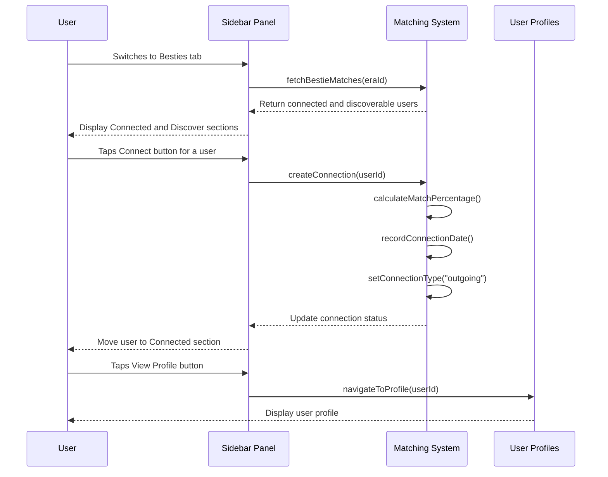
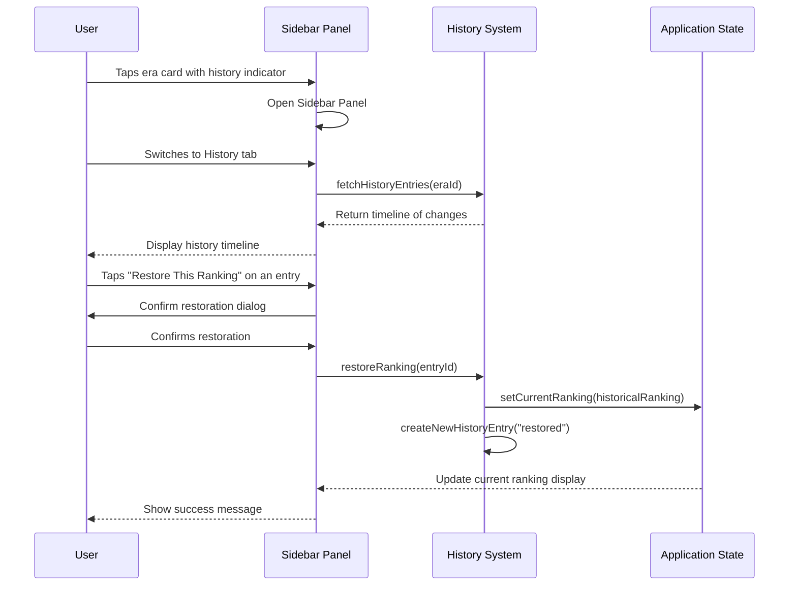
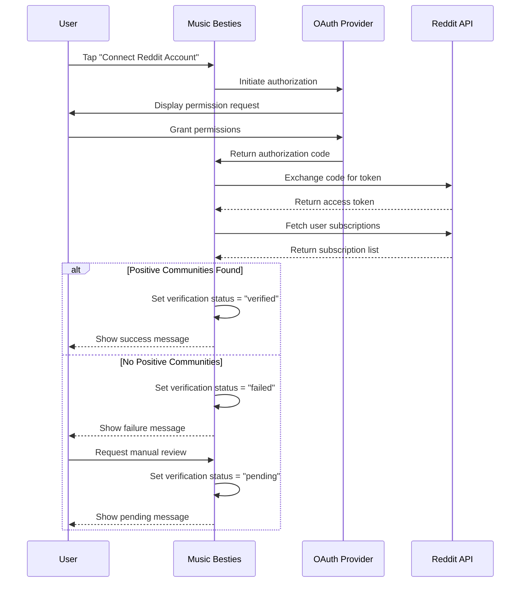
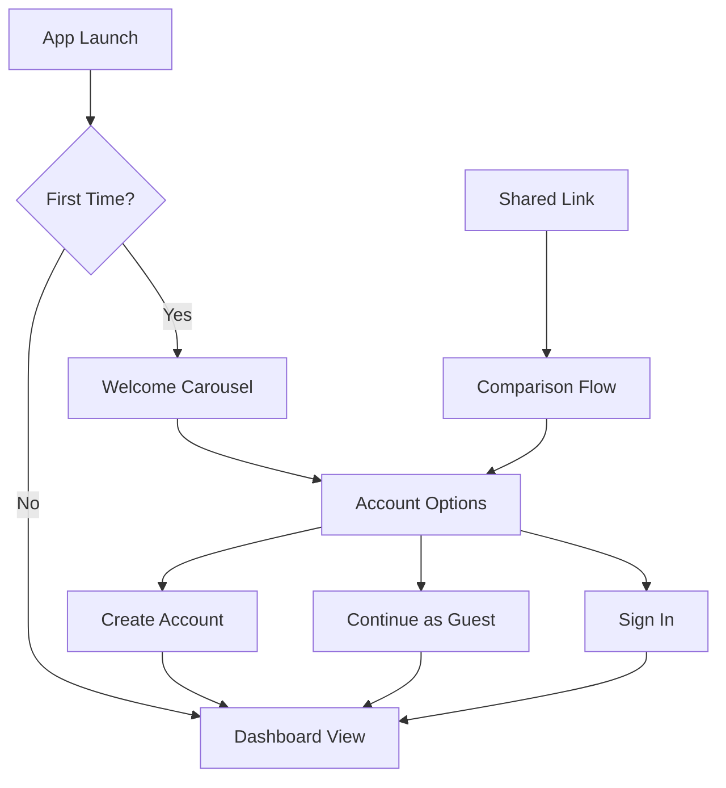
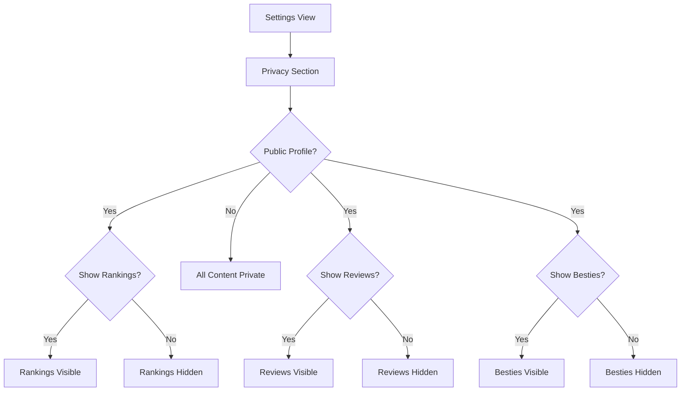

# User Interactions

This section shows all possible ways users can interact with the app <!-- AI: Never edit this text -->

## Selection and Ranking Workflow

**Figure: Selection Interaction Flow**

*Step-by-step visualization of how items transition between selected and unselected states through user tap interactions, including the new cooldown timer check before saving. Clarifies the exact behavior expected when users interact with selectable items, including the visual state changes, numbering, and save limitations.*

### Era Ranking

The era ranking workflow allows users to create a personalized ranking of their favorite music eras. The process works as follows:

1. User navigates to the Edit Rankings View
2. User selects the "Eras" tab
3. User taps on unselected era chips to add them to the ranking
4. The order is determined by the sequence of selection
5. User taps on selected era chips to remove them from the ranking
6. User checks the cooldown timer to see if saving is available
7. User saves changes to persist the ranking (if cooldown period has elapsed)
8. System creates a history entry to track the changes

### Song Ranking

The song ranking workflow allows users to create a personalized ranking of songs within an era. The process works as follows:

1. User navigates to the Edit Rankings View
2. User selects an era-specific tab
3. User taps on unselected song chips to add them to the ranking
4. The order is determined by the sequence of selection
5. User taps on selected song chips to remove them from the ranking
6. User checks the cooldown timer to see if saving is available
7. User saves changes to persist the ranking (if cooldown period has elapsed)
8. System creates a history entry to track the changes

### Cooldown Timer Interaction

The 24-hour cooldown feature limits how frequently users can save ranking changes:

1. After saving rankings, a 24-hour cooldown period begins
2. The cooldown timer displays the remaining time until the next save is available
3. During the cooldown period, users can still make changes but cannot save them
4. Once the cooldown period ends, the save button becomes active again
5. The timer persists between sessions using localStorage

**Figure: Cooldown Timer Flow**

*State diagram showing the cooldown timer's different display modes and transitions based on remaining time. Clarifies how the timer behaves as it approaches completion and how it affects the save functionality.*

## Review Workflow

### Creating/Editing Reviews

The review creation workflow allows users to add ratings and comments to music eras. The process works as follows:

1. User navigates to the Dashboard View
2. User taps on an era card to open the Sidebar Panel
3. User switches to the "Review & Notes" tab
4. User taps the Edit Review button
5. User sets a star rating (1-5 stars)
6. User adds a text comment (maximum 140 characters)
7. User saves the review to persist the changes
8. User can optionally share the review via social media

### Viewing Reviews

Users can view reviews for eras through the Sidebar Panel. The process works as follows:

1. User navigates to the Dashboard View
2. User taps on an era card to open the Sidebar Panel
3. User switches to the "Review & Notes" tab
4. The review section displays the current rating and comment

### Sharing Reviews

Users can share their reviews with others:

1. User navigates to a review in the Sidebar Panel
2. User taps the Share button
3. User selects a sharing platform or copies the link
4. System generates a shareable link with preview data
5. User shares the link through their chosen platform

## Sidebar Panel Interactions

### Three-Layer Navigation

The sidebar panel implements a three-layer navigation approach that allows users to move between different levels of content:

1. **Layer 1 Navigation:**
   - User taps on an era card on the Dashboard View
   - System opens the sidebar panel showing the era's song list in the Your Journal tab
   - User can switch between Your Journal, Community, and Besties tabs

2. **Layer 2 Navigation:**
   - When viewing a list of songs, user taps on a specific song
   - System navigates to Layer 3 showing the song details
   - The Besties tab becomes unavailable at Layer 3

3. **Layer 3 Navigation:**
   - User can view and edit their review and comments for the song
   - User can view community reviews and comments for the song
   - User taps the breadcrumb navigation to return to previous layers

**Figure: Sidebar Navigation Flow**

*State diagram showing the three-layer navigation flow in the sidebar panel, including tab switching and the unavailability of the Besties tab in Layer 3.*

### Your Journal Interactions

The Your Journal tab allows users to view and manage their personal content:

1. **Viewing Song List:**
   - User navigates to an era in the sidebar panel
   - System displays a list of the user's ranked songs for that era
   - Each song card shows rank, title, rating, and comment count

2. **Viewing Song Details:**
   - User taps on a song card to view details
   - System displays the song's rank, user's rating, review, and comments
   - User can see their review history with previous versions

3. **Adding/Editing Reviews:**
   - User taps the Edit Review button
   - User sets a star rating (1-5 stars)
   - User adds or edits review text
   - User saves the review to persist changes

4. **Adding Comments:**
   - User taps the Add Comment button
   - User enters comment text
   - User saves the comment to add it to the list
   - Comments are displayed in reverse chronological order

### Community Interactions

The Community tab allows users to view and interact with content from other users:

1. **Viewing Community Reviews:**
   - User switches to the Community tab
   - System displays a list of reviews from other users
   - Each review shows username, rating, and preview text

2. **Expanding Community Reviews:**
   - User taps the Expand button on a review
   - System displays the full review with associated comments
   - User can view the reviewer's profile

3. **Viewing Review Comments:**
   - When viewing an expanded review, user can see comments
   - Comments are displayed in chronological order
   - User can expand comments to see full text

### Bestie Matching Interactions

The Besties tab allows users to connect with others who have similar music preferences:

1. **Viewing Bestie Matches:**
   - User switches to the Besties tab
   - System displays two sections: Connected and Discover
   - Connected shows users already connected with
   - Discover shows potential new connections

2. **Connecting with Besties:**
   - User views potential matches in the Discover section
   - User taps the Connect button for a user they want to connect with
   - System creates a connection between the users
   - Connected user moves to the Connected section

3. **Viewing Bestie Profiles:**
   - User taps the View Profile button for a bestie
   - System navigates to the bestie's profile page
   - User can see the bestie's rankings and reviews

4. **Viewing Ranking Similarities:**
   - User can see match percentage with each bestie
   - User can scroll through chips showing the bestie's top ranked songs
   - Connection type is indicated with directional icons (↑ for outgoing, ↓ for incoming)

**Figure: Bestie Matching Interaction Flow**

*Sequence diagram showing the interaction flow for bestie matching, including viewing matches, connecting with users, and viewing profiles.*

## History Tracking

### Viewing Ranking History

Users can view the history of their ranking changes:

1. User navigates to the Dashboard View
2. User taps on an era card with a history indicator
3. User navigates to a song in the Your Journal tab
4. User views the Review History section showing previous versions
5. User can tap on a date to view the review from that point in time

### Restoring Previous Rankings

Users can restore rankings from a previous point in time:

1. User navigates to the History tab in the Sidebar Panel
2. User browses the timeline to find the desired previous ranking
3. User taps the "Restore This Ranking" button
4. System confirms the action with the user
5. System restores the selected ranking as the current ranking
6. A new history entry is created to track this restoration

**Figure: History Interaction Flow**

*Sequence diagram showing the interaction flow for viewing and restoring ranking history. Illustrates how users can navigate through their historical rankings and restore previous versions.*

## Social Features

### Bestie Matching

Users can find others with similar music taste:

1. User navigates to the Bestie Matching View
2. System displays a league table of users ranked by similarity
3. User can view match percentages and common favorite songs
4. User can tap on entries to view public profiles
5. User can filter results by various criteria
6. User can see their own rank in the overall community

### Reddit Verification

Users can verify their Reddit account to access social features:

1. User navigates to Settings
2. User taps "Connect Reddit Account" in the Account Verification section
3. System opens OAuth authorization flow in a browser window
4. User grants permission to the Music Besties application
5. System checks for subscription to positive fan communities
6. System displays verification success or failure
7. If verification fails, user can request manual review

**Figure: Reddit Verification Flow**

*Sequence diagram illustrating the Reddit verification process, including the OAuth flow and community membership verification. Shows the different paths based on verification success or failure.*

## Onboarding Flow

### New User Onboarding

First-time users are guided through an introduction to the app:

1. User opens the app for the first time
2. System displays welcome carousel with feature highlights
3. User swipes through introduction slides
4. System presents account creation options
5. User chooses to create an account or continue as guest
6. System completes onboarding and navigates to the Dashboard View

### Guest Mode

Users can start using the app without creating an account:

1. User taps "Continue as Guest" during onboarding
2. System creates a temporary local profile
3. User can use all core app features
4. Rankings and reviews are stored locally
5. Social features are limited or unavailable
6. User can upgrade to a full account at any time

### Shared Link Entry

Users arriving via shared links experience a tailored onboarding:

1. User opens a shared link to a ranking or review
2. System displays the shared content
3. System offers comparison between shared rankings and user's own (if they exist)
4. User can create an account, continue as guest, or sign in
5. After authentication, user can interact with the shared content

**Figure: Onboarding Paths**

*Flowchart showing the different paths users can take during onboarding, including standard first-time flow, guest mode, and shared link entry. Illustrates how these paths converge at the Dashboard View.*

## Navigation Patterns

### Dashboard Navigation

The Dashboard View provides the following navigation options:

- Tapping the hamburger menu icon opens the Left Sidebar Navigation
- Tapping the Edit button enters edit mode
- Tapping on an era card opens the Sidebar Panel for that era
- Tapping on a history indicator opens the Sidebar Panel with the History tab active

### Edit Rankings Navigation

The Edit Rankings View provides the following navigation options:

- Tabs allow switching between "Eras" and individual era names
- The Cancel button (red) discards changes and returns to the Dashboard View
- The Save button (green) persists changes and returns to the Dashboard View (if cooldown period has elapsed)
- The cooldown timer displays time until next save is available

### Sidebar Panel Navigation

The Sidebar Panel provides the following navigation options:

- The X close button closes the panel and returns to the previous view
- Tabs allow switching between "Rankings," "History," and "Review & Notes"
- The Edit Review button navigates to the review form
- The Share buttons allow sharing rankings or reviews
- The Restore button in History tab restores previous rankings

### Left Sidebar Navigation

The Left Sidebar Navigation provides the following navigation options:

- Menu items for Dashboard, Your Besties, Profile, Settings, About, and Terms & Privacy
- The X close button dismisses the sidebar
- Visual indicators show the currently active section
- Account options for guest users
- Login/Register options for unauthenticated users

### Bestie Matching Navigation

The Bestie Matching View provides the following navigation options:

- League table entries can be tapped to view user profiles
- Filter controls allow refining the displayed matches
- Back button returns to the previous view
- Connect Reddit Account button for unverified users

### Profile Navigation

The Profile View provides the following navigation options:

- Public profile link can be copied or shared
- Edit Preferences button navigates to Settings
- View All Matches button navigates to Bestie Matching View
- Back button returns to the previous view

## Privacy Controls

### Setting Privacy Preferences

Users can control what information is visible to others:

1. User navigates to Settings
2. User toggles options in the Privacy section
3. System applies the selected privacy settings immediately
4. User can preview how their profile appears to others

### Privacy-Aware Sharing

When sharing content, privacy settings are respected:

1. User initiates sharing of rankings or reviews
2. System checks current privacy settings
3. System generates shareable content based on allowed visibility
4. User is informed if privacy settings limit what can be shared

**Figure: Privacy Settings Flow**

*Flowchart illustrating how privacy settings affect content visibility. Shows the hierarchical nature of privacy controls and how they determine what content is visible to other users.*
